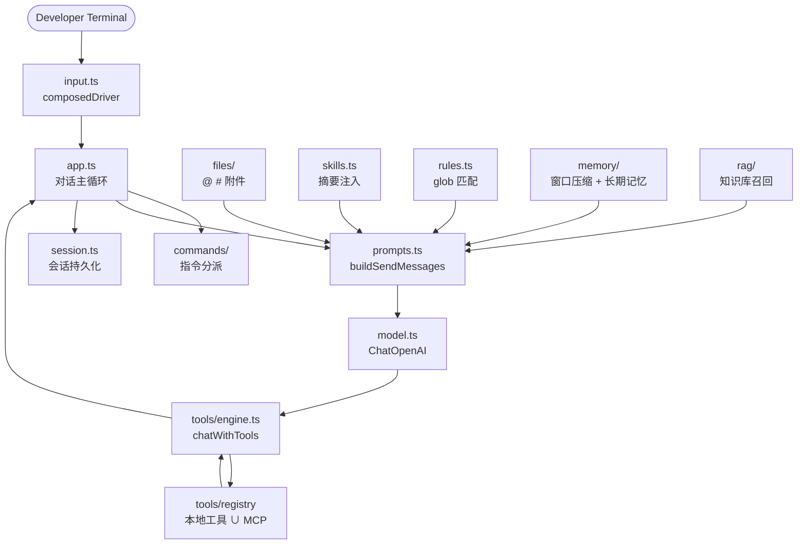
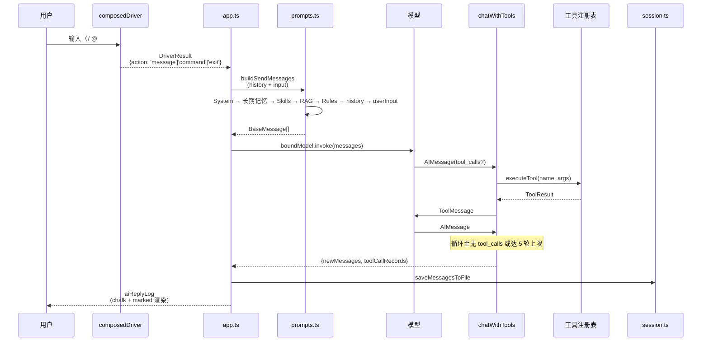
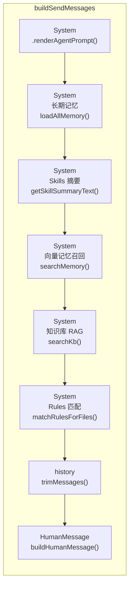

# FrontCode

仓库地址：https://github.com/bidboss/bid-agent

通用编程 AI 终端助手（CLI），定位类似 Claude Code。在终端内完成对话、读写代码、工具调用与知识检索，并提供可扩展的本地工具链与上下文工程。前端场景（设计稿对照、Playwright 调试）作为示例工作流通过 MCP 自由接入。

---

## 一、产品价值

- **终端内闭环开发**：提问 → 读代码 → 改文件 → 确认 → 工具调用 → 结果回传，减少 IDE 与聊天工具之间的来回切换。
- **项目级上下文**：自动注入系统提示（`.front/AGENTS.md`）、长期记忆、Skills、Rules、RAG 检索结果，回答更贴合当前仓库与个人习惯。
- **短期记忆窗口**：按 token 数自动压缩历史（默认 400 tokens），被截掉的轮次用 LLM 摘要保留关键事实。
- **可扩展工具层**：本地 Function Tools 与 MCP 统一注册，可接外部服务而不改核心对话循环。
- **本地工具链友好**：`@` 附加源码、`#` 附加图片（vision 注入）、任意工具由 MCP 自由接入。
- **用户 / 项目双层配置**：`~/.front` 与 `.front` 分层，偏好与项目规范互不干扰。

---

## 二、功能介绍

### 1. 对话与上下文

| 能力 | 说明 |
|------|------|
| 多轮对话 | 维护 `messages` 历史，支持工具调用后再追问 |
| 系统角色 | 读取项目 `.front/AGENTS.md`（支持 frontmatter 定义 name / version / tools 等） |
| 长期记忆 | `.front/memory/memory.md`（用户级 + 项目级），`/memory` 指令触发写入 |
| 短期记忆窗口 | 按 token 数截断历史，被截段用 LLM 摘要替代（`length / 3` 估算） |
| Skills | `.front/skills/<name>/SKILL.md`，启动时扫描并注入摘要（tier=1 默认），按需 `skill_load` 加载全文 |
| Rules | `.front/rules/*.md`，按 glob 匹配 `@[file]` 选中的文件后自动附加 |
| RAG 知识库 | `.front/kb/`（用户级 + 项目级）文档向量化入库，`/vector` 触发索引，按 query 召回 top-4 片段注入对话 |
| 会话持久化 | JSON 文件落盘（`.front/sessions/<userId>/default.json`），退出时自动保存 |

### 2. 终端增强输入（Cursor 风格 composedDriver）

输入框以回车为分界，触发符规则：

- **`/`**：弹出指令下拉候选（内置 + 自定义），选中立即执行
- **`@`**：弹出项目文件候选，选中后追加 `@[path]` 标签到输入缓冲区，继续编辑后再按回车发送
- **`#`**：弹出 `.front/design` 图片候选，选中后追加 `#[name]` 标签，以 `image_url`（data URI）形式注入模型

三个附件（`@` 文件、`#` 图片）作为独立 content block 传给 LangChain，不混入纯文本。

### 3. 内置指令

| 指令 | 作用 |
|------|------|
| `/help` | 帮助与使用技巧 |
| `/clear` | 清空当前对话历史（磁盘文件保留） |
| `/context` | 查看当前会话状态（消息数 / token 估算 / 文件路径） |
| `/memory` | 让模型分析并写入长期记忆 |
| `/vector` | 将 `.front/kb` 文档向量化并存入知识库 |
| `/exit` / `/quit` | 退出并保存会话（Ctrl+C / ESC 等价） |
| 自定义指令 | `.front/commands/<组>/<名>.md` → `/组:名`（passthrough 追加正文 或 print 直接打印） |

### 4. 本地工具（Function Calling）

| 工具 | 作用 |
|------|------|
| `read_file` | 读取文件内容 |
| `write_file` | 写入或覆盖文件 |
| `grep` | 按正则搜索文件内容 |
| `glob` | 按模式匹配项目文件 |
| `bash` | 执行 shell 命令 |
| `confirm` | 终端确认交互（是 / 否） |
| `select` | 终端选项交互（单选） |
| `memory_get` | 读取长期记忆（项目级 / 用户级） |
| `memory_save` | 保存长期记忆（追加模式） |
| `skill_load` | 按 name 加载完整 Skill 内容 |
| `get_location` | 演示工具：获取地理位置 |
| `search_restaurant` | 演示工具：搜索餐厅 |
| `place_order` | 演示工具：下单 |

### 5. MCP 扩展

在 `.front/settings.json` 的 `mcpServer` 中配置 HTTP / SSE / stdio 服务后，工具以 `<服务名>__<工具名>` 形式并入同一工具列表。

### 6. 差异化能力

- **Vision 注入**：`#` 选择 `.front/design` 图片后以 vision content block 注入模型，通用能力不仅限前端。
- **跨场景工具接入**：Playwright 页面调试、数据库查询、CI 触发等场景均通过 MCP 接入，非内置工具，统一以 `<服务名>__<工具名>` 命名空间并入对话循环。
- **可插拔工作流**：任意能通过 MCP 描述的能力都可以"装上即用"，不修改核心对话循环。

---

## 三、技术栈

### 运行时与语言

- Node.js 18+ / ESM（`"type": "module"`）
- TypeScript（strict 模式 + tsx 执行）

### AI 与编排

#### 模型与消息层（依赖 LangChain）

| 依赖 | 用途 |
|------|------|
| `@langchain/core` | `SystemMessage` / `HumanMessage` / `AIMessage` / `ToolMessage` 消息类型与 `ToolDefinition` 结构 |
| `@langchain/openai` | `ChatOpenAI` 工厂（替代裸调 OpenAI SDK，适配任意 OpenAI 兼容网关） |
| `@langchain/textsplitters` | RAG 文档切分（`chunkSize=500` / `overlap=80`） |

#### 编排与工具层（自研）

| 模块 | 说明 |
|------|------|
| `src/lc/prompts.ts` | `buildSendMessages`：6 层 SystemMessage 注入（角色 → 长期记忆 → Skills → 向量记忆 → RAG → Rules） |
| `src/lc/tools/engine.ts` | `chatWithTools`：自研工具调用循环，最多 5 轮，未使用 `AgentExecutor` / `ToolNode` 等高层抽象 |
| `src/lc/tools/mcp/adapter.ts` | MCP 工具描述 → LangChain `ToolDefinition` 适配器 |

> 本项目仅借用 LangChain 的消息类型与模型工厂，
> 工具调用循环、上下文拼装、Memory / RAG / Skills / Rules 等编排逻辑均为自研实现。

### 工具与扩展

| 依赖 | 用途 |
|------|------|
| `@modelcontextprotocol/sdk` | MCP 客户端（Stdio / SSE / StreamableHTTP） |
| `openai` | Embedding 调用（直连网关） |

### 向量库与文档

| 依赖 | 用途 |
|------|------|
| `@lancedb/lancedb` | 本地向量库（`.front/lancedb-data/`） |
| `mammoth` | docx 文本提取（RAG） |
| `gray-matter` | AGENTS.md frontmatter 解析 |

### 终端交互

| 依赖 | 用途 |
|------|------|
| `@inquirer/prompts` | 指令 / 文件 / 图片候选下拉 |
| `ora` | 加载态 |
| `chalk` | 终端彩色文字 |
| `marked` + `marked-terminal` | Markdown 终端渲染 |
| `ansi-escapes` | 光标与终端控制 |

### 页面调试

| 依赖 | 用途 |
|------|------|
| `playwright` | 页面调试与截图（由 MCP 扩展使用） |
| `minimatch` | Rules glob 匹配 |

### 工程

- `tsx`（开发执行） / `typescript` / `@types/node`

---

## 四、目录结构

```
src/lc/                          # LC 引擎（全部 TypeScript）
├── app.ts                       # CLI 入口：composedDriver 状态机 + 对话主循环
├── agents.ts                    # 读取 .front/AGENTS.md，渲染系统提示模板
├── config.ts                    # 配置归一化（项目级 vs 用户级 settings.json）
├── model.ts                     # ChatOpenAI 工厂
├── messages.ts                  # 消息构造（buildHumanMessage / buildAIMessage 等）
├── prompts.ts                   # buildSendMessages：上下文拼装（System → 记忆 → Skills → RAG → Rules → history → user）
├── session.ts                   # 会话 JSON 持久化（load / save）
├── input.ts                     # composedDriver：终端输入 + @ / # / 触发符处理
├── log.ts                       # 工具调用记录 + AI 回复日志（chalk + marked 渲染）
├── type.ts                      # EmbeddingConfig / ModelConfig / CreateChatModelOptions
├── rules.ts                     # Rules glob 匹配（minimatch）
├── skills.ts                    # Skills 扫描与摘要注入
├── utils/pathUtils.ts           # 路径工具（cwd / homeDir）
├── commands/                    # 内置指令
│   ├── help.ts                 # /help
│   ├── clear.ts                # /clear
│   ├── context.ts              # /context
│   ├── memory.ts               # /memory
│   ├── vector.ts               # /vector
│   └── custom.ts               # 自定义指令（mtime 缓存）
├── files/                       # 文件 / 设计图扫描与标签解析
│   └── index.ts               # scanProjectFiles / scanDesignImages / attachFilesToMessage 等
├── memory/                      # 记忆体系
│   ├── index.ts               # 对外统一出口
│   ├── store.ts               # .front/memory/memory.md 读写
│   ├── window.ts              # 短期窗口压缩（按 token 截断 + LLM 摘要）
│   ├── vector.ts              # 向量记忆索引与召回（LanceDB memory_embeddings 表）
│   ├── prompt.ts              # 记忆渲染模板
│   └── type.ts                # 类型定义
├── rag/                         # 知识库 RAG
│   ├── index.ts               # 对外统一出口
│   ├── kb.ts                 # .front/kb/ 文档索引（LanceDB kb_embeddings 表）
│   ├── search.ts             # 向量召回
│   ├── template.ts           # RAG 渲染模板（docs/ragTemplate.md + DEFAULT_TEMPLATE）
│   └── type.ts               # 类型定义
├── tools/                       # 工具引擎
│   ├── engine.ts              # chatWithTools：工具循环（MAX 5 轮）
│   ├── index.ts              # 同步注册 13 个本地工具 + 暴露 registerAllMcpTools
│   ├── registry.ts            # 工具注册表（registerTool / listTools / executeTool）
│   ├── type.ts                # 工具类型
│   ├── implementations/        # 13 个本地工具实现（read_file / write_file / grep / glob / bash / memory_* / skill_load / confirm / select / 演示工具）
│   │   ├── bash.ts
│   │   ├── confirm.ts
│   │   ├── get_location.ts
│   │   ├── glob.ts
│   │   ├── grep.ts
│   │   ├── memory_get.ts
│   │   ├── memory_save.ts
│   │   ├── place_order.ts
│   │   ├── read_file.ts
│   │   ├── search_restaurant.ts
│   │   ├── select.ts
│   │   ├── skill_load.ts
│   │   └── write_file.ts
│   └── mcp/                   # MCP 扩展
│       ├── loader.ts           # loadMcpServers / disconnectAllMcp
│       ├── adapter.ts          # registerMcpTools：SDK → LangChain ToolDefinition
│       └── types.ts           # MCP 配置类型
└── types/                       # 第三方库 .d.ts
    └── marked-terminal.d.ts

scripts/                          # 冒烟自检脚本（ts / mjs / mts）
├── smoke-lc.mjs               # LC 引擎冒烟（配置 → 模型 → 流式）
├── app-smoke.ts
├── core-tools-smoke.ts
├── custom-commands-smoke.mts
├── files-smoke.ts
├── input-smoke.ts
├── memory-smoke.ts
├── rag-smoke.ts
├── skill-smoke.ts
└── commands-smoke.mts

docs/                            # 设计 / 调研文档（沉淀目录）
改造/                            # 迁移记录（plan / 评估报告）
.front/                          # 运行时数据（项目级）
```

---

## 五、启动方式

### 1. 环境要求

- Node.js 18+
- 可访问的 OpenAI 兼容 API（示例：DeepSeek / 通义 DashScope Compatible Mode）
- 页面调试时需要 Playwright 浏览器

### 2. 安装

```bash
npm install
# 可选：全局链接
npm link
# 之后可在任意目录执行
front
```

### 3. 启动命令

| 命令 | 作用 |
|------|------|
| `npm run dev` | 开发模式（tsx + 读取 .env） |
| `npm run smoke` | LC 引擎冒烟自检（配置 → 模型 → 流式） |
| `npm run typecheck` | tsc --noEmit |
| `npm run build` | tsc 编译 |
| `npx front` | CLI 启动（bin 入口：`src/lc/app.ts`） |

### 4. 配置 API（.front/settings.json）

搜索顺序：项目 `.front/settings.json` → 用户 `~/.front/settings.json`（项目级同名覆盖用户级）。

```json
{
  "baseURL": "https://api.deepseek.com/v1",
  "apiKey": "sk-xxx",
  "model": "deepseek-flash",
  "userId": "可选，默认 os.userInfo().username",
  "embedding": {
    "model": "可选，独立 embedding 网关；未配置时 RAG 静默降级返回空"
  },
  "mcpServer": {
    "demo": {
      "type": "stdio",
      "command": "npx",
      "args": ["-y", "some-mcp-server"]
    }
  }
}
```

字段说明：

| 字段 | 必填 | 说明 |
|------|------|------|
| `baseURL` | 是 | OpenAI 兼容 API 地址 |
| `apiKey` | 是 | 密钥 |
| `model` | 否 | 默认 `deepseek-flash` |
| `userId` | 否 | 会话归属，未设置取系统用户名 |
| `embedding` | 否 | RAG / 向量记忆专用，可独立 baseURL/apiKey；未配置时向量功能静默降级 |
| `mcpServer` | 否 | MCP 服务集合（`type`: stdio / sse / http / streamablehttp） |

### 5. 运行时数据目录（.front）

```text
.front/
├── settings.json      # API 配置（项目级）
├── AGENTS.md          # 系统角色定义（frontmatter: name / version / tools）
├── memory/
│   └── memory.md      # 长期记忆（项目级）
├── kb/               # RAG 知识库源文档（md / txt / docx）
├── lancedb-data/     # LanceDB 向量库
├── design/           # 设计稿图片（png / jpg / gif / bmp / webp）
├── screenshot/       # 调试截图
├── rules/            # 路径匹配规则（*.md）
├── skills/           # Skill 包（<name>/SKILL.md）
├── commands/         # 自定义指令（<组>/<名>.md）
└── sessions/         # 会话 JSON（<userId>/default.json）
```

用户级 `~/.front/` 同样布局，同名字段**项目级覆盖**。

### 6. 常用工作流

1. **改代码**：描述需求，或 `@[src/App.vue]` 附加文件；模型经 `confirm` 后 `write_file`
2. **设计稿还原**：把图片放进 `.front/design/`，输入 `#` 选择后说明需求（以图片形式注入）
3. **知识库**：把文档放进 `.front/kb/`，执行 `/vector` 向量化，之后对话自动检索相关片段
4. **调试**：代码改完可通过 MCP 扩展的 Playwright 工具截图

---

## 六、实现架构

### 总体架构



### 一轮对话数据流



### 上下文拼装顺序（buildSendMessages 内部）



拼装顺序：System（6 层依次追加） → 历史消息（窗口压缩后） → 用户消息（含 @[#] 附件的独立 content block）。

---

## 七、安全与规范提示

- 危险写操作（写文件 / 执行 shell）前应经 `confirm` 确认。
- `settings.json` 含密钥，请加入忽略规则，不要提交到公开仓库。
- 生成代码时注意与项目 `package.json` 中依赖版本一致，避免胡编 API。
- LangChain 版本当前锁定 `@langchain/core@^1.2.11`，升级需验证兼容性。
