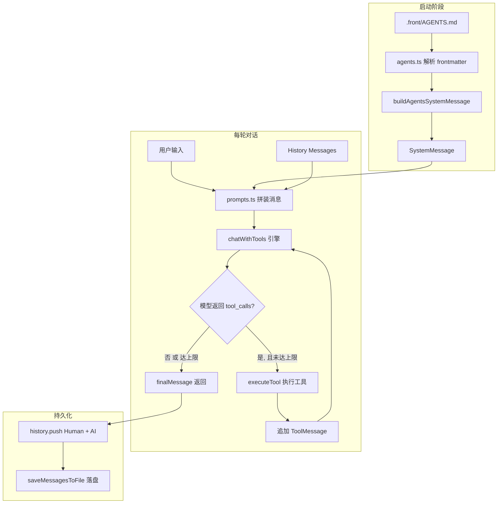

# Phase 2：系统上下文 + 工具循环调用体系

## 目标

1. **系统上下文**：从 `.front/AGENTS.md` 读取系统配置，通过 YAML frontmatter 提取元数据 + 内容正文，整体拼入 `SystemMessage` 顶部。
2. **工具调用循环**：模型返回 `tool_calls` 时自动执行对应工具，结果反馈给模型继续，直到模型不再调用工具或达到上限（5 次）。

---

## 一、文件变更总览

| 操作 | 文件 |
|------|------|
| 新建 | `src/lc/agents.ts` |
| 新建 | `src/lc/tools/engine.ts` |
| 新建 | `src/lc/tools/types.ts` |
| 新建 | `src/lc/tools/registry.ts` |
| 新建 | `src/lc/tools/implementations/bash.ts` |
| 新建 | `src/lc/tools/implementations/read_file.ts` |
| 新建 | `src/lc/tools/implementations/write_file.ts` |
| 新建 | `src/lc/tools/implementations/grep.ts` |
| 新建 | `src/lc/tools/implementations/glob.ts` |
| 新建 | `src/lc/tools/implementations/confirm.ts` |
| 新建 | `src/lc/tools/implementations/select.ts` |
| 新建 | `src/lc/tools/implementations/memory_save.ts` |
| 新建 | `src/lc/tools/implementations/memory_get.ts` |
| 新建 | `src/lc/tools/implementations/bash.ts` |
| 修改 | `src/lc/prompts.ts` |
| 修改 | `src/lc/app.ts` |

---

## 二、AGENTS.md 格式约定

`.front/AGENTS.md` 使用 YAML frontmatter：

```markdown
---
userId: lxh
name: 前端助手
version: "1.0"
tools: [read_file, write_file, bash, grep]
---

# 系统角色

你是一个专业的前端开发助手...

## 工具说明

当你需要读取项目文件时，使用 read_file 工具...
```

### 解析流程

```
.front/AGENTS.md 文件
    ↓ gray-matter 解析
{ data: { userId, name, version, tools }, content: "...markdown正文..." }
    ↓ 拼入 SystemMessage 顶部
SystemMessage { content: "[元数据摘要]\n\n[content 正文]" }
    ↓ 追加 buildSkillMessages() 的 skill 上下文（Phase 3 预留）
[SystemMessage] + [SkillMessages] + [History] + [HumanMessage]
```

### `src/lc/agents.ts` 设计（调整：引入 ChatPromptTemplate）

> **调整说明**：原方案是 `loadAgentsDoc()` 直接拼 `SystemMessage`；现改为
> ① 解析 md → `{ meta, content }`
> ② 把 `content` 包成 `ChatPromptTemplate.fromMessages([['system', content]])`，支持 `{变量名}` 插值
> ③ `renderAgentPrompt()` 渲染出 `BaseMessage[]`
> ④ 不接管历史，历史仍由 `session.ts` / `app.ts` 维护
> ⑤ 不破坏序列化：`renderAgentPrompt()` 输出的就是 `BaseMessage`，`toDict()` 仍可用

#### AGENTS.md 格式不变

```markdown
---
userId: lxh
name: 前端助手
version: "1.0"
tools: [read_file, write_file, bash, grep]
---

# 系统角色

你是一个专业的前端开发助手。当前用户: {userName}，工作目录: {cwd}。

## 工具说明

当你需要读取项目文件时，使用 read_file 工具...
```

> 正文里出现的 `{userName}` / `{cwd}` 等占位符由调用方在 `renderAgentPrompt(variables)` 时传入。

#### 完整实现

```typescript
import fs from 'fs';
import path from 'path';
import matter from 'gray-matter';
import { ChatPromptTemplate } from '@langchain/core/prompts';
import type { BaseMessage } from '@langchain/core/messages';
import { getCurrentWorkingDir } from './utils/pathUtils.ts';

export interface AgentsMeta {
  userId: string;
  name: string;
  version: string;
  tools: string[];
}

export interface AgentsDoc {
  meta: AgentsMeta;
  content: string;        // markdown 正文，含 {变量名} 占位符
  template: ChatPromptTemplate; // 已构建好的 system 模板
}

/**
 * 读取并解析 .front/AGENTS.md
 * - 文件不存在 → 返回默认 doc（默认 content 也是合法 ChatPromptTemplate 文本）
 * - 同步构建 ChatPromptTemplate 一次，避免每轮重新构造
 */
export function loadAgentsDoc(): AgentsDoc {
  let meta: AgentsMeta = { userId: '', name: 'AI 助手', version: '1.0', tools: [] };
  let content = '你是一个友好的 AI 助手。当前用户: {userName}，工作目录: {cwd}。';

  const filePath = path.join(getCurrentWorkingDir(), '.front', 'AGENTS.md');
  if (fs.existsSync(filePath)) {
    const raw = fs.readFileSync(filePath, 'utf-8').replace(/^\uFEFF/, '');
    const { data, content: mdContent } = matter(raw);
    meta = {
      userId: data.userId ?? '',
      name: data.name ?? 'AI 助手',
      version: data.version ?? '1.0',
      tools: Array.isArray(data.tools) ? data.tools : [],
    };
    content = mdContent.trim();
    if (!content) content = '你是一个友好的 AI 助手。当前用户: {userName}，工作目录: {cwd}。';
  }

  const template = ChatPromptTemplate.fromMessages([['system', content]]);
  return { meta, content, template };
}

/**
 * 渲染 agent 提示模板为 BaseMessage[]
 * - variables: 传给 ChatPromptTemplate 的变量（如 userName、cwd 等）
 * - 同步读取 doc，渲染模板，返回渲染后的消息数组
 * - 返回的消息由 ChatPromptTemplate 构造，保持 LangChain 原生类型，可直接 toDict()
 */
export async function renderAgentPrompt(
  variables: Record<string, string> = {},
): Promise<{ meta: AgentsMeta; messages: BaseMessage[] }> {
  const doc = loadAgentsDoc();

  // 默认注入一些常用变量
  const vars: Record<string, string> = {
    userName: doc.meta.userId || 'unknown',
    cwd: getCurrentWorkingDir(),
    agentName: doc.meta.name,
    agentVersion: doc.meta.version,
    tools: doc.meta.tools.join(', ') || '无',
    ...variables,
  };

  const messages = await doc.template.formatMessages(vars);
  return { meta: doc.meta, messages };
}
```

#### 渲染示例

```typescript
const { meta, messages } = await renderAgentPrompt({ userName: 'lxh' });
// messages[0] = SystemMessage({ content: "...你是一个专业的前端开发助手。当前用户: lxh..." })
// 可以直接 push 进 history，由 session.ts 序列化落盘（toDict 不受影响）
```

#### 关键不变

- `session.ts` 的 `saveMessagesToFile` / `loadMessagesFromFile` **不需要任何改动**。
- `additional_kwargs` / `run_id` / `response_metadata` 序列化逻辑**不变**。
- `buildSkillMessages()`（Phase 3）继续在 `prompts.ts` 拼接，不与 ChatPromptTemplate 冲突。
- `ChatPromptTemplate` 只负责「渲染系统消息」，**不维护历史**。

---


---

## 三、工具类型定义

### `src/lc/tools/types.ts`

```typescript
/**
 * 工具的 JSON Schema 输入参数（JSON Schema subset）
 */
export interface ToolParameterSchema {
  type: 'string' | 'number' | 'boolean' | 'object' | 'array';
  description?: string;
  properties?: Record<string, ToolParameterSchema>;
  required?: string[];
  items?: ToolParameterSchema;
  enum?: string[];
}

/**
 * 工具定义（暴露给模型的元信息）
 */
export interface ToolDefinition {
  name: string;
  description: string;
  inputSchema: ToolParameterSchema;
}

/**
 * 工具执行结果
 */
export interface ToolResult {
  success: boolean;
  content: string;
  error?: string;
}

/**
 * 工具执行器函数签名
 */
export type ToolExecutor = (
  args: Record<string, unknown>
) => Promise<ToolResult>;
```

---

## 四、工具注册中心

### `src/lc/tools/registry.ts`

```typescript
import type { ToolDefinition, ToolExecutor, ToolResult } from './types.js';
import { zodToJsonSchema } from 'zod-to-json-schema';
import { z } from 'zod';

const toolStore = new Map<string, { def: ToolDefinition; executor: ToolExecutor }>();

export function registerTool(
  name: string,
  description: string,
  schema: z.ZodType,
  executor: ToolExecutor
): void {
  const inputSchema = zodToJsonSchema(schema) as ToolDefinition['inputSchema'];
  toolStore.set(name, {
    def: { name, description, inputSchema },
    executor,
  });
}

export function getTool(name: string) {
  return toolStore.get(name);
}

export function listTools(): ToolDefinition[] {
  return Array.from(toolStore.values()).map((t) => t.def);
}

export async function executeTool(
  name: string,
  args: Record<string, unknown>
): Promise<ToolResult> {
  const tool = toolStore.get(name);
  if (!tool) return { success: false, content: '', error: `Unknown tool: ${name}` };
  try {
    return await tool.executor(args);
  } catch (e: any) {
    return { success: false, content: '', error: e.message };
  }
}
```

---

## 五、工具实现（按工具分文件）

每个工具在 `src/lc/tools/implementations/` 下独立文件，导出 `{ name, description, schema, execute }`。

以 `read_file.ts` 为例：

```typescript
import fs from 'fs';
import path from 'path';
import { z } from 'zod';
import { registerTool } from '../registry.js';

const schema = z.object({
  file_path: z.string().describe('要读取的文件路径'),
  offset: z.number().int().min(1).optional().default(1).describe('起始行号，从1开始'),
  limit: z.number().int().positive().optional().describe('最多读取行数'),
});

const MAX_READ_SIZE = 1024 * 1024; // 1MB

async function execute(args: z.infer<typeof schema>) {
  const { file_path, offset = 1, limit } = args;
  const resolvedPath = path.resolve(file_path);

  if (!fs.existsSync(resolvedPath)) {
    return { success: false, content: '', error: `文件不存在: ${resolvedPath}` };
  }
  const stat = fs.statSync(resolvedPath);
  if (!stat.isFile()) {
    return { success: false, content: '', error: `路径不是文件: ${resolvedPath}` };
  }
  if (stat.size > MAX_READ_SIZE) {
    return { success: false, content: '', error: `文件超过 ${MAX_READ_SIZE} 字节限制` };
  }

  try {
    const content = fs.readFileSync(resolvedPath, 'utf-8');
    const lines = content.split(/\r?\n/);
    const startIdx = Math.max(0, offset - 1);
    const endIdx = limit ? Math.min(lines.length, startIdx + limit) : lines.length;
    const selected = lines.slice(startIdx, endIdx);
    const result = selected.map((line, i) => `${offset + i}: ${line}`).join('\n');
    return { success: true, content: result };
  } catch (e: any) {
    return { success: false, content: '', error: e.message };
  }
}

export default { name: 'read_file', description: '读取本地文件内容，支持 offset/limit 分段读取', schema, execute };
```

其他工具（`write_file`、`grep`、`glob`、`confirm`、`select`、`memory_save`、`memory_get`、`bash`）结构相同，各自实现 `execute` 函数。

---

## 六、引擎（工具循环调用）

### 设计原则

**所有工具调用的中间消息（AIMessage 含 tool_calls + 每次的 ToolMessage）都必须可入历史**，否则多轮上下文和会话恢复都会丢工具执行细节。

`chatWithTools` 的契约是「**只读 + 返回新增**」：

- 入参 `messages`：**不会被修改**（函数内部用副本）
- 返回 `newMessages: BaseMessage[]`：**本轮所有新产生的消息**（含 AIMessage、ToolMessage），由调用方决定是否追加进持久化历史

### `src/lc/tools/engine.ts`

```typescript
import { AIMessage, ToolMessage, type BaseMessage } from '@langchain/core/messages';
import { executeTool } from './registry.js';

export const MAX_TOOL_CALLS = 5; // 循环上限

export interface ToolCallTurn {
  toolCallId: string;
  toolName: string;
  args: Record<string, unknown>;
  result: string;
  success: boolean;
}

export interface ChatWithToolsResult {
  /** 本轮所有新产生的消息，顺序正确（AIMessage(tool_call) → ToolMessage → … → 最终 AIMessage） */
  newMessages: BaseMessage[];
  /** 结构化工具调用记录（仅日志/UI 用） */
  toolCallHistory: ToolCallTurn[];
}

/**
 * 带工具循环的模型调用
 *
 * 流程：
 * 1. 取 messages 的副本（不修改入参）
 * 2. 模型调用 → 检查 tool_calls
 *    - 无 tool_calls → 循环结束
 *    - 有 tool_calls → 对每个 tool_call 顺序执行，追加 ToolMessage，再调模型
 * 3. 直到无 tool_calls 或达到 MAX_TOOL_CALLS 上限
 * 4. 整个轮次产生的所有新消息返回给调用方
 */
export async function chatWithTools(
  model: any,
  messages: BaseMessage[],
): Promise<ChatWithToolsResult> {
  const workingMessages = [...messages];
  const toolCallHistory: ToolCallTurn[] = [];

  // 已完成「工具调用轮次」的计数：每轮 = 模型一次响应 + 后续所有 tool_call 一次性串行执行
  let rounds = 0;

  while (true) {
    // 1. 模型调用
    const response: AIMessage = await model.invoke(workingMessages);
    workingMessages.push(response);

    const toolCalls = (response as any).tool_calls ?? [];
    if (toolCalls.length === 0) break; // 模型决定不调用工具 → 结束

    // 2. 串行执行每个工具调用，追加 ToolMessage
    for (const tc of toolCalls) {
      const toolName: string = tc.name;
      const toolArgs: Record<string, unknown> = tc.args ?? {};
      const toolCallId: string = tc.id;

      const result = await executeTool(toolName, toolArgs);
      const resultContent = result.success
        ? result.content
        : `Error: ${result.error ?? 'unknown'}`;

      const toolMsg = new ToolMessage({
        tool_call_id: toolCallId,
        content: resultContent,
      });
      workingMessages.push(toolMsg);
      toolCallHistory.push({
        toolCallId,
        toolName,
        args: toolArgs,
        result: resultContent,
        success: result.success,
      });
    }

    rounds++;
    if (rounds >= MAX_TOOL_CALLS) break; // 达到轮次上限 → 强制退出
  }

  // 只把「本轮新增的消息」返回给上层（不含用户传入的 system/history）
  const newMessages = workingMessages.slice(messages.length);
  return { newMessages, toolCallHistory };
}
```

> **关键点**：`messages.length` 是入参长度，`workingMessages` 是入参副本，`workingMessages.slice(messages.length)` 拿到的是**本轮从第一次 `model.invoke` 开始产生的所有新消息**。
> 这些消息包括：所有带 `tool_calls` 的 AIMessage 和对应的 ToolMessage，最终的 AIMessage。

### LangChain 工具绑定

`model.bind({ tools })` 把工具定义挂到 ChatOpenAI 上，模型就能在响应里返回 `tool_calls`：

```typescript
import { convertToOpenAITool } from '@langchain/core/utils/functionCalling';
import { listTools } from './registry.js';
import { ChatOpenAI } from '@langchain/openai';

const boundModel: ChatOpenAI = model.bind({
  tools: listTools().map(convertToOpenAITool),
});
```

---

## 七、prompts.ts 修改

将 `prompts.ts` 中的硬编码系统提示改为调用 `renderAgentPrompt()`（异步）：

```typescript
// prompts.ts

import type { BaseMessage } from '@langchain/core/messages';
import { buildHumanMessage } from './messages.js';
import { renderAgentPrompt } from './agents.js';

// Phase 3 接入 skills 占位
function buildSkillMessages(): BaseMessage[] {
  return [];
}

/**
 * 拼装本轮对话要发给模型的完整消息列表
 * - 系统消息由 renderAgentPrompt() 异步渲染（支持 AGENTS.md 模板变量）
 * - 历史消息保持 BaseMessage[] 形态不变（由 session.ts 维护）
 */
export async function buildSendMessages(
  history: BaseMessage[],
  userInput: string,
): Promise<BaseMessage[]> {
  const messages: BaseMessage[] = [];

  // 1. 系统消息（从 AGENTS.md 异步渲染）
  const { messages: agentMessages } = await renderAgentPrompt();
  messages.push(...agentMessages);

  // 2. skill 占位（Phase 3 接入）
  messages.push(...buildSkillMessages());

  // 3. 历史消息
  messages.push(...history);

  // 4. 当前用户输入
  messages.push(buildHumanMessage({ text: userInput }));

  return messages;
}
```

> **变化点**：`buildSendMessages` 从同步函数变成 `async`，因为 `ChatPromptTemplate.formatMessages` 是异步的。`app.ts` 调用处加 `await` 即可。

### ChatPromptTemplate 职责边界

| 能力 | 谁负责 |
|------|--------|
| **解析 AGENTS.md frontmatter** | `agents.ts`（`loadAgentsDoc()`） |
| **解析 markdown 正文中的 `{var}` 占位** | `ChatPromptTemplate.fromMessages()` |
| **构造 SystemMessage 列表** | `renderAgentPrompt()` |
| **变量注入（userName / cwd / tools 等）** | `renderAgentPrompt()` 默认值 + 调用方传入 |
| **多轮对话历史** | ❌ ChatPromptTemplate **不管**，继续由 `app.ts` 的 `history` 数组 + `session.ts` 的快照 + 日志负责 |
| **消息序列化（toDict / coerceMessageLikeToMessage）** | 仍然是 LangChain 原生机制，ChatPromptTemplate 渲染出的 `BaseMessage` 与手写 `new SystemMessage(...)` 完全等价 |

> 关键不变量：**会话历史、日志、`additional_kwargs` / `run_id` 序列化逻辑完全不变**。
> `ChatPromptTemplate` 只是把「拼装系统消息」这件事从字符串拼接升级成了模板渲染。

#### 序列化不变性验证

| 字段 | 来源 | 序列化行为 |
|------|------|------------|
| `additional_kwargs` | 模型返回（AIMessage） / 透传字段 | `toDict()` 原样保留，**不变** |
| `run_id` / `id` | LangChain 消息实例 | `toDict()` 原样保留，**不变** |
| `response_metadata` | 模型返回 | `toDict()` 原样保留，**不变** |
| `tool_calls` / `tool_call_id` | 工具调用相关 | `toDict()` 原样保留，**不变** |

`renderAgentPrompt()` 渲染出的 `BaseMessage` 仍然是 LangChain 标准实例（`new SystemMessage(...)`），所以 `.toDict()` 输出格式与之前完全一致。

---

## 八、app.ts 修改（核心改动）

```typescript
// app.ts

import { chatWithTools } from './tools/engine.js';
import { listTools } from './tools/registry.js';
import { convertToOpenAITool } from '@langchain/core/utils/functionCalling';
import { HumanMessage } from '@langchain/core/messages';
import { buildHumanMessage } from './messages.js';
// ... 现有 imports

async function main() {
  // 现有：加载配置、会话
  const config = getModelConfig();
  const { meta, messages: history } = loadMessagesFromFile(sessionFilePath);

  // 创建模型 + 绑定工具
  const model = createChatModel({ temperature: 0.7 });
  const boundModel = model.bind({
    tools: listTools().map(convertToOpenAITool),
  });

  while (true) {
    const userInput = (await input({ message: '问：' })).trim();
    if (!userInput || userInput === 'exit' || userInput === 'quit') break;

    // 拼装本轮输入：系统（异步渲染）+ skill 占位 + history + userInput
    const sendMessages = await buildSendMessages(history, userInput);

    // 调用引擎（工具循环）
    const { newMessages, toolCallHistory } = await chatWithTools(boundModel, sendMessages);

    // 打印工具调用记录（仅日志用）
    if (toolCallHistory.length > 0) {
      console.log('\n[工具调用记录]');
      for (const tc of toolCallHistory) {
        console.log(`  ${tc.toolName}(${JSON.stringify(tc.args)})`);
        console.log(`    → ${tc.success ? tc.result.slice(0, 200) : '[失败] ' + tc.result}`);
      }
      console.log();
    }

    // 关键：把本轮所有新消息（HumanMessage + AIMessage(tool_call) + ToolMessage × N + 最终 AIMessage）
    // 全部追加进 history，最终一起落盘
    history.push(buildHumanMessage({ text: userInput }));
    for (const msg of newMessages) {
      history.push(msg);
    }

    // 打印最终 AI 回复
    const lastAi = [...newMessages].reverse().find(
      (m) => m.constructor.name === 'AIMessage'
    );
    if (lastAi) console.log(`AI: ${getMessageText(lastAi as any)}`);

    // 落盘
    saveMessagesToFile(sessionFilePath, history, metaToSave);
  }
}
```

> **约定**：`engine.ts` 返回的 `newMessages` 只含 `AIMessage` / `ToolMessage`，所有 `AIMessage(tool_calls)` 和其对应的 `ToolMessage` 都按调用顺序排列，**HumanMessage 由 `app.ts` 单独追加以保证构造一致性**。

---

## 九、ToolMessage 入持久化的影响

| 维度 | 影响 |
|------|------|
| **JSON 体积** | 每个 ToolMessage 都进 JSON，工具结果大的话文件变胖。可接受（本地会话文件，没瓶颈） |
| **重放一致性** | 上次会话中工具执行过的结果，下次重新 `model.invoke(history)` 时直接看到，避免重新执行 |
| **会话文件结构** | 历史里会出现形如下面的序列，LangChain 原生支持：`AIMessage(tool_calls) → ToolMessage → AIMessage(tool_calls) → ToolMessage → AIMessage(无 tool_call)` |
| **多模态工具结果** | 后续如果工具返回图片，ToolMessage 的 content 可以是数组，与 HumanMessage 同理，**不需要特殊处理** |

### 验证落盘格式

落盘后 `default.json` 里 `messages` 数组会包含 `{ type: "ai", data: { tool_calls: [...] } }` 和 `{ type: "tool", data: { tool_call_id, content } }` 两种消息，由 `coerceMessageLikeToMessage()` 自动还原成 `AIMessage`/`ToolMessage` 实例。**`session.ts` 不需要任何改动**，因为它本来就是 LangChain 原生序列化方案。

---

## 十、执行清单

1. **安装依赖**：`gray-matter`（解析 frontmatter）、`zod`（参数校验）、`zod-to-json-schema`（生成 JSON Schema）
2. **重写 `src/lc/agents.ts`**（旧的 `buildAgentsSystemMessage()` 已废弃）：
   - 保留 `loadAgentsDoc()` 解析逻辑（gray-matter）
   - 新增：构造 `ChatPromptTemplate.fromMessages([['system', content]])`
   - 新增 `renderAgentPrompt(variables): Promise<{ meta, messages }>` 异步渲染函数
   - 默认注入 `userName` / `cwd` / `agentName` / `agentVersion` / `tools` 变量
3. **新建 `src/lc/tools/types.ts`**：工具类型定义
4. **新建 `src/lc/tools/registry.ts`**：工具注册中心
5. **新建 `src/lc/tools/engine.ts`**：工具循环调用引擎
6. **TS 重写各工具**（按依赖顺序）：
   - `read_file.ts` → `write_file.ts` → `grep.ts` → `glob.ts` → `bash.ts` → `confirm.ts` → `select.ts` → `memory_save.ts` → `memory_get.ts`
   - 每个工具独立文件，在 `registry.ts` 统一 `registerTool` 注册
7. **修改 `src/lc/prompts.ts`**：
   - 删除 `PLACEHOLDER_SYSTEM_PROMPT` 占位
   - 改为 `async function buildSendMessages(...)`
   - 用 `await renderAgentPrompt()` 替换旧的 `buildAgentsSystemMessage()`
8. **修改 `src/lc/app.ts`**：绑定工具 + 调用 `chatWithTools` 引擎 + 打印工具调用记录
9. **创建 `.front/AGENTS.md`**：配置示例文件（含 frontmatter + 正文）
10. **运行 `npm run typecheck`**：确保 TS 无错误
11. **运行 `npm run dev`**，手动验证：
    - 读取 AGENTS.md 系统上下文生效
    - 模型调用工具 → 执行结果反馈 → 模型再次响应
    - 工具循环达到 5 次时正确停止
    - 历史消息包含 ToolMessage，落盘后重启能恢复

---

## 十一、数据流图



---

## 十二、风险点

| 风险 | 应对 |
|------|------|
| `gray-matter` 解析失败 | 降级返回默认 SystemMessage |
| 工具参数校验失败（zod） | `executeTool` 捕获验证错误，返回 `ToolResult { success: false }` |
| 工具执行超时/异常 | try/catch 包裹，返回错误信息，不中断循环 |
| 循环达到 5 次仍不停止 | engine.ts 强制 break，写入最后模型响应 |
| `convertToOpenAITool` 不兼容 | 改用 `model.withStructuredOutput` 或手动拼 `function_call` 格式 |