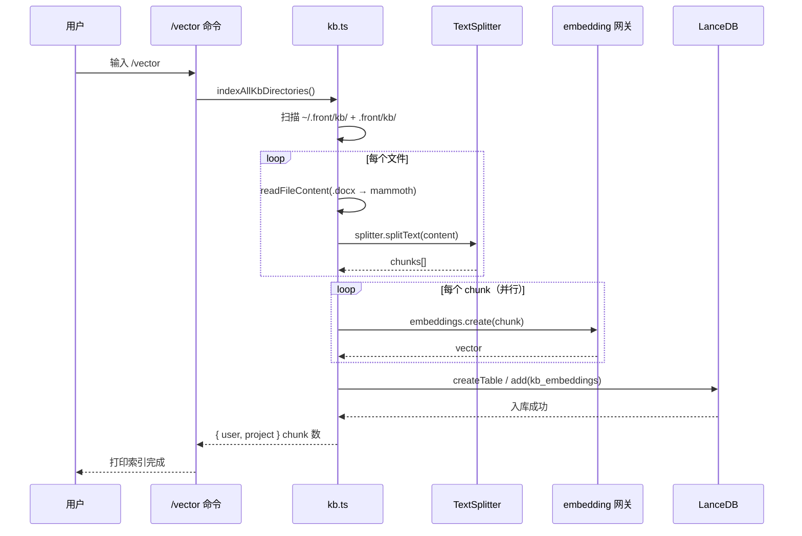
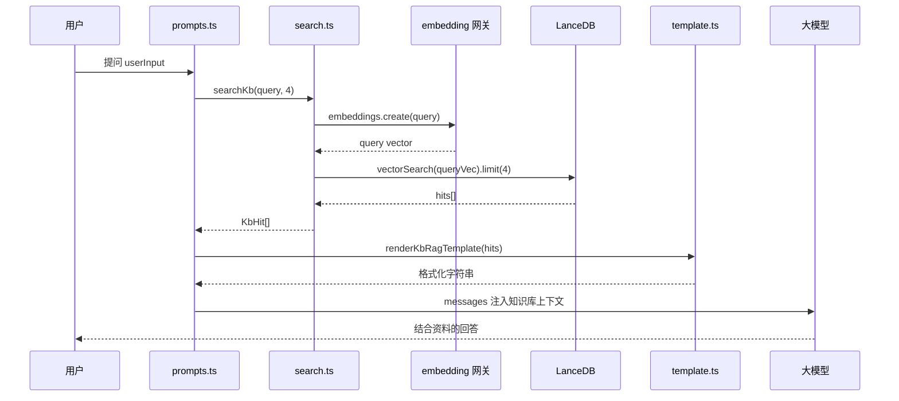
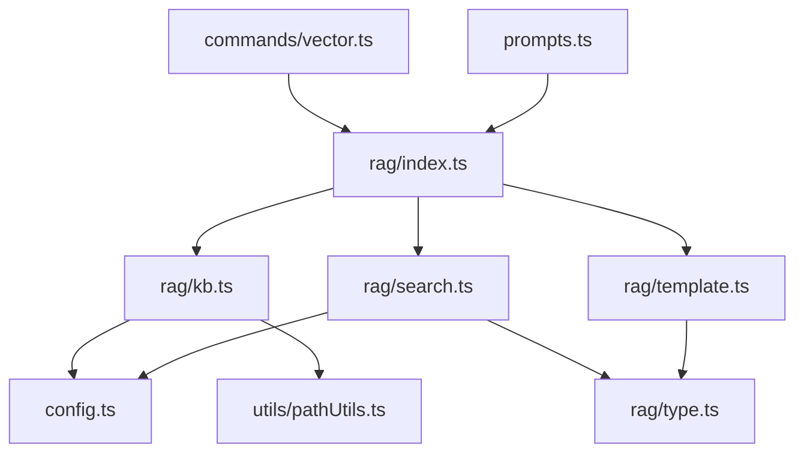

# 知识库 RAG 设计方案

> Phase 5 知识库检索增强（Retrieval-Augmented Generation）设计方案。
> 目的：把本地知识库（`.front/kb/`）作为大模型的外部参考，让模型回答时能引用项目专属资料。

---

## 一、文档处理流水线

### 1.1 全流程概览

```mermaid
flowchart LR
    A[用户触发 /vector] --> B[扫描 .front/kb/]
    B --> C{判断文件类型}
    C -->|.md/.txt| D[fs 读取文本]
    C -->|.docx| E[mammoth 提取纯文本]
    D --> F[RecursiveCharacterTextSplitter]
    E --> F
    F --> G[切分成 chunks]
    G --> H[并行调用 embedding]
    H --> I[写入 LanceDB kb_embeddings]
    I --> J[/vector 完成]

    K[用户对话] --> L[query 转向量]
    L --> M[vectorSearch top-K]
    M --> N[renderKbRagTemplate]
    N --> O[注入 prompts.ts]
    O --> P[模型生成回答]
```

### 1.2 索引阶段（写入）



### 1.3 检索阶段（读取）



---

## 二、数据模型

### 2.1 LanceDB 表 `kb_embeddings`

```typescript
interface KbRecord {
  id: string;        // 主键：`${Date.now()}-${rand}`
  text: string;      // 文本片段内容
  path: string;      // 来源文件绝对路径
  vector: number[];  // embedding 向量（维度由 embedding 模型决定）
}
```

### 2.2 检索命中 `KbHit`

```typescript
interface KbHit {
  text: string;   // 文档片段内容
  path: string;   // 来源文件路径
  score: number;  // 相似度距离（越小越相似）
}
```

### 2.3 字段映射

| KbRecord | KbHit | 说明 |
|----------|-------|------|
| `text` | `text` | 直接透传 |
| `path` | `path` | 直接透传 |
| `_distance` | `score` | LanceDB 返回的向量距离 |
| `vector` / `id` | — | 不暴露给上层 |

---

## 三、关键设计

### 3.1 两套目录层级

| 层级 | 路径 | 用途 |
|------|------|------|
| 用户级 | `~/.front/kb/` | 跨项目共享的个人资料 |
| 项目级 | `.front/kb/` | 当前项目专属知识库 |

`indexAllKbDirectories()` 并行索引两个目录，统计各自的 chunk 数。

### 3.2 表名隔离

LanceDB 数据目录（`.front/lancedb-data/`）与记忆模块共用，但表名不同：

| 模块 | 表名 |
|------|------|
| 记忆 | `memory_embeddings` |
| 知识库 | `kb_embeddings` |

避免数据互相污染。

### 3.3 静默降级

`embedding` 未在 `settings.json` 中配置时：

- `getEmbedding()` 返回 `null`
- `searchKb()` 返回 `[]`
- `indexKbFile()` / `indexKbDirectory()` 返回 `0`，跳过入库

**不抛错，不阻塞主对话流程**，与记忆模块的处理策略一致。

### 3.4 LanceDB 返回值兼容

`executeQuery()` 适配 LanceDB 不同版本的 execute 返回类型：

| 类型 | 处理 |
|------|------|
| `Array` | 直接返回 |
| `AsyncIterable` | `for await` 收集 |
| `Iterable` | `Array.from` |
| 其他 | 返回 `[]` |

---

## 四、切分过程

### 4.1 切分器选型

`@langchain/textsplitters` 的 `RecursiveCharacterTextSplitter`：

- **chunkSize = 500**：每个片段 500 字符
- **chunkOverlap = 80**：相邻片段重叠 80 字符，避免语义被截断
- **递归切分**：优先按段落 → 句子 → 单词的优先级切分

### 4.2 切分前后

**切分前**（一个 .md 文件）：

```
# Vue 3 指南

Vue 3 是一个用于构建用户界面的渐进式 JavaScript 框架。它提供了组合式 API...

## 响应式原理

Vue 3 使用 Proxy 实现响应式系统，相比 Vue 2 的 Object.defineProperty...
```

**切分后**（chunk 示例）：

```
Chunk 1 (≈500 字符):
"# Vue 3 指南\n\nVue 3 是一个用于构建用户界面的渐进式 JavaScript 框架..."
                                  ↓ overlap 80 字符
Chunk 2 (≈500 字符):
"渐进式 JavaScript 框架...\n\n## 响应式原理\n\nVue 3 使用 Proxy 实现..."
```

### 4.3 文档读取

```typescript
function readFileContent(filePath: string): Promise<string> {
  if (ext === '.docx') {
    return mammoth.extractRawText({ path: filePath }).then(r => r.value);
  }
  return fs.readFileSync(filePath, 'utf-8');
}
```

仅支持三种扩展名：`.md`、`.txt`、`.docx`。

---

## 五、向量化过程

### 5.1 Embedding 调用

```typescript
async function getEmbedding(text: string): Promise<number[] | null> {
  const cfg = getModelConfig().embedding;  // 从 settings.json 读取
  if (!cfg) return null;                    // 未配置 → 静默降级
  const client = new OpenAI({ apiKey: cfg.apiKey, baseURL: cfg.baseURL });
  const resp = await client.embeddings.create({ model: cfg.model, input: text });
  return resp.data[0].embedding;
}
```

### 5.2 并行加速

索引阶段对所有 chunks 并行调用 embedding（`Promise.all`），将串行的 N 次调用压缩为 1 轮网络往返。

### 5.3 失败容忍

单个 chunk embedding 调用失败时：
- 打印 warning 但不中断流程
- 该 chunk 跳过，不入库
- 最终返回成功的 chunk 数

---

## 六、对外暴露的方法

### 6.1 `src/lc/rag/index.ts`（统一出口）

| 方法 | 签名 | 用途 |
|------|------|------|
| `indexKbFile` | `(filePath: string) => Promise<number>` | 索引单个文件 |
| `indexKbDirectory` | `(dir: string, dbPath: string) => Promise<number>` | 索引单个目录 |
| `indexAllKbDirectories` | `() => Promise<{ user: number; project: number }>` | 索引用户级 + 项目级 |
| `searchKb` | `(query: string, limit?: number) => Promise<KbHit[]>` | 向量检索 |
| `renderKbRagTemplate` | `(hits: KbHit[]) => string` | 模板渲染 |
| `KbHit` (type) | — | 检索命中类型 |

### 6.2 上下游调用方

| 上游 | 调用 | 用途 |
|------|------|------|
| `src/lc/commands/vector.ts` | `indexAllKbDirectories` | `/vector` 指令入口 |
| `src/lc/prompts.ts` | `searchKb` + `renderKbRagTemplate` | 每轮对话自动注入知识库 |

---

## 七、代码地图

```
src/lc/rag/
├── index.ts          # 8 行：统一对外出口
├── kb.ts             # 194 行：索引层（写）
├── search.ts         # 71 行：检索层（读）
├── template.ts       # 33 行：模板渲染
└── type.ts           # KbHit 类型定义

docs/
└── ragTemplate.md    # 渲染模板（含 ${ragContent} 占位符）

scripts/
└── rag-smoke.ts      # 冒烟自检脚本（11 个断言）

src/lc/commands/
└── vector.ts         # /vector 指令实现

src/lc/prompts.ts     # buildKbRecallMessage 注入点
```

### 7.1 模块依赖关系



---

## 八、第三方工具

### 8.1 存储：LanceDB

| 项 | 说明 |
|----|------|
| 包名 | `@lancedb/lancedb` |
| 类型 | 进程内嵌入式向量数据库 |
| 数据目录 | `.front/lancedb-data/` |
| 表名 | `kb_embeddings` |
| 特点 | 无服务端、零部署；同库多表隔离；与记忆模块共用目录 |

### 8.2 切分：LangChain TextSplitter

| 项 | 说明 |
|----|------|
| 包名 | `@langchain/textsplitters` |
| 类 | `RecursiveCharacterTextSplitter` |
| 参数 | `chunkSize=500`, `chunkOverlap=80` |
| 特点 | 递归切分（段落 → 句子 → 单词），保证语义连贯 |

### 8.3 向量化：OpenAI 兼容 Embedding API

| 项 | 说明 |
|----|------|
| 包名 | `openai` |
| 调用方式 | `client.embeddings.create({ model, input })` |
| 配置位置 | `.front/settings.json` → `embedding` 字段 |
| 兼容网关 | DeepSeek 等 OpenAI 兼容协议均可 |

### 8.4 docx 解析：mammoth

| 项 | 说明 |
|----|------|
| 包名 | `mammoth` |
| 用途 | `.docx` → 纯文本提取 |
| 调用 | `mammoth.extractRawText({ path })` |

### 8.5 第三方依赖汇总

| 包名 | 作用 |
|------|------|
| `@lancedb/lancedb` | 向量数据库 |
| `@langchain/textsplitters` | 文本切分器 |
| `openai` | Embedding SDK |
| `mammoth` | docx 解析 |

---

## 九、配置示例

`.front/settings.json`：

```json
{
  "baseURL": "https://api.deepseek.com/v1",
  "apiKey": "sk-xxx",
  "model": "deepseek-chat",
  "embedding": {
    "baseURL": "https://api.openai.com/v1",
    "apiKey": "sk-xxx",
    "model": "text-embedding-3-small"
  }
}
```

未配置 `embedding` 字段时，RAG 模块静默降级，主对话不受影响。

---

## 十、目录约定

```
.front/
├── kb/
│   ├── 项目手册.md          # 项目级知识库
│   ├── 团队规范.md
│   └── 产品需求.docx
├── lancedb-data/
│   └── kb_embeddings/      # 自动生成
└── settings.json           # 包含 embedding 配置
```

用户级：`~/.front/kb/`（跨项目共享）

---

## 十一、后续扩展

| 方向 | 说明 |
|------|------|
| 增量索引 | 监听文件变化，仅索引新增/修改的文档 |
| 元数据过滤 | 支持按目录、标签过滤检索范围 |
| 引用渲染 | 在回答中标注引用来源 `[知识库1] [知识库2]` |
| 多模态 | 支持图片、PDF 文档 |
| 删除接口 | 提供 `removeKbFile` 等清理 API |

