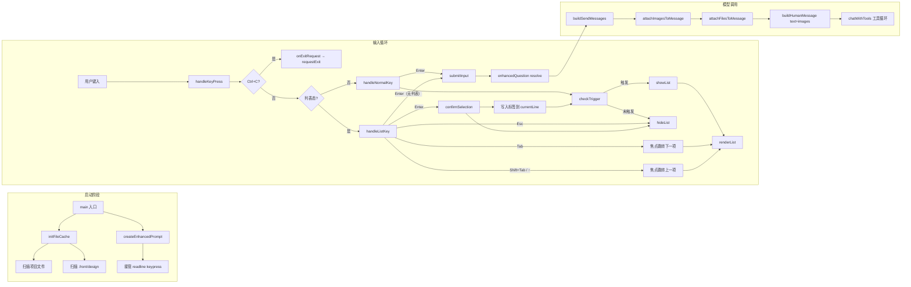
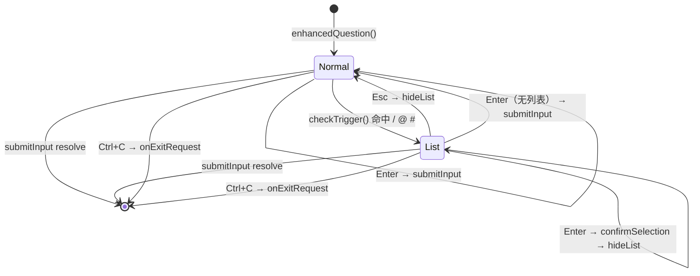
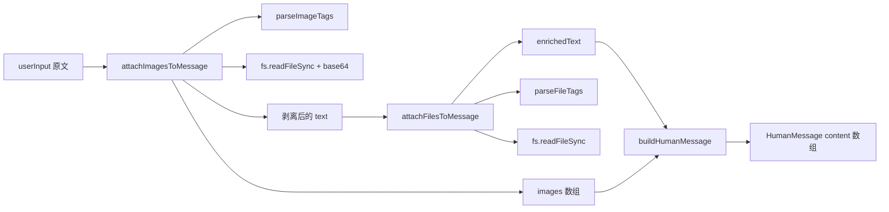

# 终端增强输入设计方案

> 在 readline 上接管 keypress，支持 `/` `@` `#` 三个触发符弹出候选列表，并把选中的 `@[file]` 文件内容 / `#[img]` 设计图按 LangChain 多模态消息格式注入到本轮消息。
>
> **文档定位**：工程实现细节（how）。规范与原则（what & why）见 `docs/终端输入交互规范调研.md`。
>
> **最新更新**：2026-09-21，对齐「终端交互优化与指令补齐」计划——指令扩至 7 条；Tab 改焦点跳转；Enter 改确认；Space 不劫持；Ctrl+C 全局退出；新增 `commandHandlers` 查表分发。

---

## 一、背景与目标

LC 引擎（`src/lc/`）在迁移早期把 `src/app.js` 的 `readline + keypress` 终端增强交互整体替换为 `@inquirer/prompts#input`。结果丢失了两大核心手感：

1. **`/` `@` `#` 三个触发符弹候选列表**——用户键入触发符后，下方实时渲染候选列表，`↑↓` 切换焦点、`Enter` 确认。
2. **选中的标签自动展开为可消费内容**——`@[file]` 选中后把文件内容追加到消息，`#[img]` 选中后以 `image_url` 形式发给模型。

本方案目标：

| 触发符 | 候选源 | 选中行为 |
|--------|--------|----------|
| `/` | 内置 7 条指令 | 写入 `/cmdName ` 到输入行，不立即提交 |
| `@` | 项目文件（`excludeDirs` 排除后递归扫描） | 写入 `@[path] `，文件内容拼到消息末尾 |
| `#` | `.front/design/` 图片 | 写入 `#[img.png] `，图片以 base64 注入消息的 `image_url` |

---

## 二、整体流程



三个阶段职责分明：

| 阶段 | 模块 | 关注点 |
|------|------|--------|
| 启动 | `src/lc/input/index.ts` | 初始化文件/图片缓存、接管 keypress |
| 输入 | `src/lc/input/index.ts` | 状态机 + ANSI/chalk 渲染 |
| 模型 | `src/lc/files/index.ts` + `src/lc/prompts.ts` | 标签解析、内容附件、消息构造 |

---

## 三、文件清单与职责

### 3.1 [src/lc/files/index.ts](src/lc/files/index.ts)

**职责**：项目文件与设计图的扫描、模糊筛选、标签解析、内容附件。**自给自足，不引用 legacy**。

| 导出函数 | 用途 |
|---------|------|
| `scanProjectFiles(dir?, baseDir?)` | 递归扫描项目文件（默认从 `process.cwd()`），返回相对路径数组（统一正斜杠） |
| `filterFiles(files, query)` | 大小写不敏感模糊筛选 |
| `readFileContent(filepath)` | 读取文件内容，失败返回 `[无法读取文件: ...]` 占位 |
| `parseFileTags(input)` | 提取 `@[filename]` 列表 |
| `attachFilesToMessage(input)` | 把 `@[file]` 文件内容追加到文本末尾，无标签时原样返回 |
| `scanDesignImages()` | 扫描 `.front/design/` 下的图片文件名 |
| `filterImages(images, query)` | 大小写不敏感模糊筛选 |
| `parseImageTags(input)` | 提取 `#[filename]` 列表 |
| `removeImageTags(input)` | 剥离 `#[filename] ` 标签，返回纯文本 |
| `getDesignImagePath(imageName)` | 拼 `.front/design/<name>` 绝对路径 |
| `attachImagesToMessage(input)` | 把 `#[img]` 展开为 `{ text, images }`，`images` 是 `data:image/...;base64,...` 数组 |

**关键常量**：

```typescript
const excludeDirs = ['node_modules', '.git', '.front', '.claude', 'dist', 'build'];
const excludeFiles = ['.DS_Store', 'Thumbs.db'];
const imageExts = ['.png', '.jpg', '.jpeg', '.gif', '.bmp', '.webp'];
```

**mime 推断**：

```typescript
function inferMimeType(filename: string): string {
  const ext = path.extname(filename).toLowerCase();
  switch (ext) {
    case '.png':  return 'image/png';
    case '.jpg':
    case '.jpeg': return 'image/jpeg';
    case '.gif':  return 'image/gif';
    case '.bmp':  return 'image/bmp';
    case '.webp': return 'image/webp';
    default:      return 'application/octet-stream';
  }
}
```

**`@[file]` 追加格式**：

```text
<原文>

--- 附加文件内容 ---

## <file>
```text
<file content>
```

## <file2>
```text
<file2 content>
```
```

**`#[img]` 返回结构**：

```typescript
attachImagesToMessage('参考 #[home.png] 布局')
// {
//   text: '参考 布局',
//   images: ['data:image/png;base64,iVBORw0KGgo...']
// }
```

### 3.2 [src/lc/input/index.ts](src/lc/input/index.ts)

**职责**：readline 接管 + 候选列表渲染。**自给自足**，仅依赖 `readline`（原生）、`ansi-escapes`、`chalk`、`./files/index.ts`。

| 导出函数 | 用途 |
|---------|------|
| `initFileCache()` | 调用 `scanProjectFiles()` + `scanDesignImages()` 填充缓存，`main` 入口调用一次 |
| `createEnhancedPrompt(rl)` | 移除 `rl.input` 默认 keypress 监听，装上自定义 handler |
| `enhancedQuestion(prompt)` | 返回 `Promise<string>`，循环内反复调用实现多轮提问 |
| `setOnExitRequest(cb)` | 注册退出回调（Ctrl+C 或 /exit 时调用） |

**模块级状态**：

```typescript
const listState: ListState = {
  visible: boolean,
  type: 'command' | 'file' | 'image' | null,
  items: Candidate[],
  selectedIndex: number,
  filterText: string,
  triggerPosition: number,   // 触发符在 currentLine 中的下标
  lastRenderedCount: number, // 上次渲染了多少条，用于 clearList 时定位光标
};
let rl: readline.Interface | null = null;
let currentLine = '';
let cursorPos = 0;
let allFiles: string[] = [];
let allImages: string[] = [];
let resolveInput: ((value: string) => void) | null = null;
let onExitRequest: (() => void) | null = null;
```

**`/ @ #` 候选源**：

| 类型 | 来源 |
|------|------|
| `command` | `getBuiltinCommands()` — 7 条内置指令 |
| `file` | `allFiles`（`@` 触发时全量，过滤由 `filterFiles` 实时做） |
| `image` | `allImages`（`#` 触发时全量，过滤由 `filterImages` 实时做） |

**内置指令（`getBuiltinCommands`）**：

```typescript
function getBuiltinCommands(): { name: string; description: string }[] {
  return [
    { name: '/help',    description: '列出所有内置指令及其用法' },
    { name: '/clear',   description: '清空当前对话历史（磁盘文件保留）' },
    { name: '/context', description: '查看当前会话状态（消息数、token、文件路径）' },
    { name: '/exit',    description: '退出对话并保存会话' },
    { name: '/quit',    description: '同 /exit' },
    { name: '/memory',  description: '生成并保存长期记忆' },
    { name: '/vector',  description: '将 .front/kb 文档向量化并存入知识库' },
  ];
}
```

`getBuiltinCommands()` 是指令源的唯一可替换点，未来只需把这里替换为 `loadAllCommands()` 即可支持自定义指令，零侵入。

---

## 四、状态机

### 4.1 两个态：`正常态` 与 `列表态`



### 4.2 按键映射（Cursor IDE 范式）

| 按键 | 列表态 | 正常态 |
|------|--------|--------|
| `↑` `↓` | 焦点切换（循环） | 原生方向键 |
| `Tab` | **焦点跳转下一项** | 原生 Tab |
| `Shift+Tab` / `↑` | 焦点跳转上一项 | 原生 Tab |
| `Enter` | **确认当前焦点项**（不回车提交整行） | 提交整行 |
| `Esc` | 关闭候选，不修改输入 | 原生 |
| `Space` | **不劫持**，原生插入空格 | 原生插入空格 |
| `Ctrl+C` | 触发退出回调 | 触发退出回调 |

### 4.3 `checkTrigger` 触发规则（三个触发符共用）

```text
触发符前字符 ∈ {行首, 空格}
   AND
触发符之后到光标位置的子串中不含空格
```

任一条件不满足 → `hideList()`。

### 4.4 选中后写入格式

| 类型 | 写入文本 |
|------|---------|
| `command` | `<before>/cmdName <after>`，光标停在命令名 + 1 后 |
| `file` | `<before>@[相对路径] <after>` |
| `image` | `<before>#[文件名] <after>` |

候选最多显示 **8 条**；超出的靠实时 `filterFiles` / `filterImages` 筛选。

---

## 五、标签内容注入

### 5.1 注入点

唯一的注入点位于 [src/lc/prompts.ts](src/lc/prompts.ts)：

```typescript
const expanded = attachImagesToMessage(userInput);
const enrichedText = attachFilesToMessage(expanded.text);
messages.push(buildHumanMessage({ text: enrichedText, images: expanded.images }));
```

**为什么先剥图片再追加文件**：避免 `@[file]` 文件内容里出现 `#[img]` 误匹配。顺序敏感。

### 5.2 与 LangChain 多模态对接

`messages.ts#buildHumanMessage` 已预留 `images?: string[]` 参数：

```typescript
export function buildHumanMessage(options: BuildHumanMessageOptions) {
  const { text, images = [] } = options;
  if (!images || images.length === 0) {
    return new HumanMessage(text ?? "");
  }
  const content: ContentItem[] = [];
  if (text) content.push({ type: "text", text });
  for (const imgUrl of images) {
    content.push({ type: "image_url", image_url: { url: imgUrl } });
  }
  return new HumanMessage({ content });
}
```

`data:image/...;base64,...` 直接作为 `image_url.url` 传给 `ChatOpenAI`，由网关透传至多模态模型。

### 5.3 数据流



### 5.4 容错

- `parseImageTags` 列出全部 `#[img]` 标签
- 对每个标签 `fs.existsSync` 检查，缺失则**静默跳过**
- `fs.readFileSync` 抛错则跳过该张，**单张失败不影响整体**
- 最终 `images[]` 是「存在的图片」子集，可能为 0
- `readFileContent` 读取失败返回 `[无法读取文件: <path>]` 占位字符串

---

## 六、指令分派（app.ts）

### 6.1 退出回调（Ctrl+C 统一）

```typescript
let exiting = false;
const requestExit = (): void => {
  if (exiting) return;
  exiting = true;
  Promise.resolve(disconnectAllMcp()).catch(() => {});
  rl.close();
  console.log('\n对话结束，会话已保存');
  process.exit(0);
};
setOnExitRequest(requestExit);
```

### 6.2 指令分派表

```typescript
const commandHandlers: Record<string, () => Promise<void>> = {
  '/help':    async () => runHelpCommand(),
  '/clear':   async () => { runClearCommand(); history.length = 0; },
  '/context': async () => runContextCommand(history, sessionFilePath),
  '/exit':    async () => requestExit(),
  '/quit':    async () => requestExit(),
  '/memory':  async () => { await runMemoryCommand(history); },
  '/vector':  async () => { await runVectorCommand(); },
};

// 主循环内：
if (commandHandlers[userInput]) {
  try { await commandHandlers[userInput](); }
  catch (e: any) { console.warn(`[${userInput}] 执行失败: ${e.message ?? e}`); }
  continue;
}
```

裸字符串 `exit` / `quit`（不带 `/`）也走 `requestExit()`，向后兼容。

---

## 七、异常路径与容错

| 场景 | 处理方式 |
|------|----------|
| 设计图 / 文件缺失或读取失败 | `fs.existsSync` 静默跳过；`readFileContent` 返回占位字符串 |
| 退格越过触发符 | 关闭列表 + 走原生退格删除触发符，不残留「幽灵列表态」 |
| 空候选（筛选无结果） | `listState.items.length === 0` → `visible = false`，不显示列表 |
| `key.name === 'shift_tab'` 跨平台不一致 | 同时检查 `key.name === 'back_tab'` 作为兜底 |
| keypress 接管失效 | 回退到原生 readline，普通字符能输入、Enter 能提交，不会崩 |
| `requestExit` 双触发 | `exiting` flag 防重入 + 立即 `process.exit(0)` |

---

## 八、工程规范

### 8.1 光标 / 颜色渲染

- 必须用 `ansi-escapes` 常量（如 `cursorUp(N)`、`eraseLine`），不要手写 `\x1b[A`
- 用 `chalk` 做高亮，**不要**用硬编码 ANSI
- Windows 终端（PowerShell / Windows Terminal）颜色可能不一致，CI 冒烟测试只验证「关键文本输出」

### 8.2 性能

- 启动期 `initFileCache()` 一次性扫描，大型 monorepo 可能耗时 100ms+
- 当前不优化；后续可改为「后台 lazy 加载 + watcher」

### 8.3 可测性

| 模块 | 测试方式 |
|------|----------|
| `files/index.ts` | `scripts/files-smoke.ts`（纯函数 + fs I/O） |
| `commands/{help,clear,context}.ts` | `scripts/commands-smoke.mts`（直接调用验证输出） |
| `input/index.ts`（keypress handler） | 端到端 `scripts/app-smoke-commands.ts` |
| 全模块加载 | `npx tsx --check ./src/lc/app.ts` |

---

## 九、验证

### 9.1 typecheck

`npx tsc --noEmit` → 0 错误。

### 9.2 单元/冒烟

`scripts/commands-smoke.mts`：

| 调用 | 验证点 |
|------|--------|
| `runHelpCommand()` | 输出含 7 条指令名 |
| `runClearCommand()` | 输出「对话历史已清空」 |
| `runContextCommand(history, path)` | user/ai/tool 计数正确、token 数 > 0、文件大小 > 0 |

### 9.3 手动验证

```bash
npx tsx ./src/lc/app.ts
```

| 操作 | 预期 |
|------|------|
| 按 Ctrl+C | 打印「对话结束，会话已保存」并退出 |
| 输入 `/` | 弹出 7 条候选，`↑↓` / `Tab` 切换焦点 |
| 列表中按 Enter | 确认当前焦点项，写入 `指令名 ` 到输入行 |
| 列表中按 Esc | 关闭候选，输入行不变 |
| 列表中按 Space | **不**确认，原生插入空格 |
| `/help` + Enter | 打印帮助列表 |
| `/clear` + Enter | 打印「对话历史已清空」 |
| `/context` + Enter | 打印消息数/token/文件路径 |
| `/exit` + Enter | 正常退出 |
| `@` 弹窗中 Tab | 焦点跳到下一项；按 Enter 才确认 |
| `#` 弹窗中 Tab | 同上 |

---

## 十、未来扩展

| 扩展点 | 实现起点 |
|--------|----------|
| `@` 多选（一次引用多个文件） | `confirmSelection` 返回 `string[]` + 候选列表顶部多选指示 |
| 分页候选（超过 8 条） | `renderList` 增加 `listState.page` + `PageUp/PageDown` |
| 自定义指令（`.front/commands/`） | `getBuiltinCommands()` 替换为 `loadAllCommands()` |
| 命令面板视觉升级（图标 / 分组） | `renderList` 改造 |
| 设计图大小限制 | `attachImagesToMessage` 加 `MAX_IMAGE_BYTES` 截断 |

---

> **文档结束** · 本设计覆盖终端增强输入全部交付，typecheck 0 错误、commands-smoke 全 PASS、app 模块加载正常。
