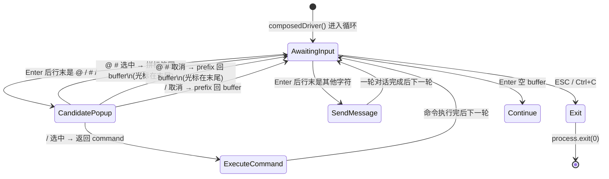

# 终端增强输入设计方案

> 基于 `@inquirer/prompts` 的统一 stdin 管理：主输入走 `input`，三个触发符 `@` `#` `/` 的候选由 `searchCandidate` 集中弹窗（`/` 走 `select`、 `@` `#` 走 `search`），本地工具 `select` / `confirm` 同样复用 inquirer。`composedDriver` 是 while 循环——回车后做"行末字符检测"，触发符选中后按语义回填 buffer（`@` `#`）或立即执行（`/`）。
>
> **文档定位**：工程实现细节（how）。规范与原则（what & why）见 `docs/终端输入交互规范调研.md`。
>
> **最新更新**：2026-09-22，对齐「终端交互模式重构」——`/ @ #` 三个触发符统一改为"回车后才检测、弹窗选中后按语义回填或执行"；本地工具 `select` / `confirm` 全部迁移至 `@inquirer/prompts`，与主输入共用 stdin，避免 readline 抢资源；`@ #` 选中后用 `prefill: 'editable'` 把标签写入 readline buffer，光标停在末尾可继续输入。

---

## 一、背景与目标

把 stdin 交互从**自写 readline keypress 状态机**重构为**统一的 inquirer prompt 栈**：

1. **统一 stdin 入口** —— 所有终端输入（主输入 / 候选列表 / 工具确认）都通过 `@inquirer/prompts`，避免抢 stdin、保证键位一致
2. **回车后检测触发符** —— 用户敲完一整行按回车，再判断行末字符是 `@` `#` `/`，按语义分发：
   - `@` `#` 选中：把 `@[path]` / `#[path]` 拼到行尾，光标停在末尾，可继续输入
   - `/` 选中：立即执行（不进 buffer）
   - 其他情况：直接走对话（含 attachments 提取）
3. **本地工具复用 inquirer** —— `select` 工具 → `inquirer.select`、`confirm` 工具 → `inquirer.confirm`，键位 / 渲染 / 取消语义与主输入完全一致

期望行为（Cursor IDE 风格）：

| 触发符 | 候选源 | 行末触发后行为 |
|--------|--------|---------------|
| `/` | 内置 7 条 + 自定义指令 | `select` 弹窗，选中即执行 |
| `@` | 项目文件（`excludeDirs` 排除后递归扫描） | `search` 模糊搜，选中拼 `@[path] ` 回输入框 |
| `#` | `.front/design/` 图片 | `search` 模糊搜，选中拼 `#[img] ` 回输入框 |

---

## 二、整体流程

```mermaid
flowchart LR
    subgraph 启动[启动阶段 - main]
        A[registerAllMcpTools] --> B[initFileCache]
        B --> B1[scanProjectFiles]
        B --> B2[scanDesignImages]
    end

    subgraph 输入[输入循环 - composedDriver]
        D[用户键入] --> E[inquirer.input]
        E --> E0{ESC / Ctrl+C?}
        E0 -->|是| E1[return exit]
        E0 -->|否| F{trim 空?}
        F -->|是| D
        F -->|否| G{行末字符?}
        G -->|@ 或 #| H[searchCandidate 弹 search]
        G -->|/| I[searchCandidate 弹 select]
        G -->|其他| M[走 extractAttachments]
        H --> J{选中?}
        I --> J{选中?}
        J -->|null| K[buffer = prefix 继续 input]
        J -->|path| L[拼 @#[path] 进 buffer, prefill='editable']
        L --> D
        J -->|cmdName| L2[return command]
        I -->|cmdName| L2
        M --> N[return message 含 attachments]
    end

    subgraph 模型[模型调用 - app.ts runOneTurn]
        N --> O[buildSendMessages]
        O --> O1[agent system + long-term memory + skills]
        O --> O2[memory recall + kb recall]
        O --> O3[matched rules]
        O --> O4[history + ComposedInput]
        O4 --> P[chatWithTools 工具循环]
        P --> Q[save to session]
    end
```

四个阶段职责分明：

| 阶段 | 模块 | 关注点 |
|------|------|--------|
| 启动 | `src/lc/app.ts` | 配置、模型、会话文件、MCP 工具、文件缓存 |
| 输入 | `src/lc/input.ts` | inquirer 循环、`extractAttachments`、返回 `DriverResult` |
| 分派 | `src/lc/app.ts` | `command` → `commandHandlers` / `runCustomCommand`；`message` → `runOneTurn` |
| 模型 | `src/lc/prompts.ts` + `src/lc/files/index.ts` + `src/lc/messages.ts` | 标签解析、内容附件、消息构造 |

---

## 三、文件清单与职责

### 3.1 [src/lc/files/index.ts](src/lc/files/index.ts)

**职责**：项目文件与设计图的扫描、模糊筛选、标签解析、内容附件（保留给 `prompts.ts` 的旧路径使用）。

| 导出函数 | 用途 |
|---------|------|
| `scanProjectFiles(dir?, baseDir?)` | 递归扫描项目文件，返回相对路径（统一正斜杠） |
| `filterFiles(files, query)` | 大小写不敏感模糊筛选 |
| `readFileContent(filepath)` | 读取文件内容，失败返回 `[无法读取文件: ...]` |
| `parseFileTags(input)` | 提取 `@[filename]` 列表 |
| `attachFilesToMessage(input)` | 把 `@[file]` 文件内容追加到文本末尾（**旧路径**） |
| `scanDesignImages()` | 扫描 `.front/design/` 下的图片文件名 |
| `filterImages(images, query)` | 大小写不敏感模糊筛选 |
| `parseImageTags(input)` | 提取 `#[filename]` 列表 |
| `removeImageTags(input)` | 剥离 `#[filename] ` 标签，返回纯文本 |
| `getDesignImagePath(imageName)` | 拼 `.front/design/<name>` 绝对路径 |
| `attachImagesToMessage(input)` | 把 `#[img]` 展开为 `{ text, images }`，`images` 是 `data:image/...;base64,...` 数组 |
| `buildFileContentBlocks(filePaths)` | 把多个文件路径展成多个 `text` content block（**新路径**用） |

**关键常量**：

```typescript
const excludeDirs = ['node_modules', '.git', '.front', '.claude', 'dist', 'build'];
const excludeFiles = ['.DS_Store', 'Thumbs.db'];
const imageExts = ['.png', '.jpg', '.jpeg', '.gif', '.bmp', '.webp'];
```

**mime 推断**：

```typescript
function inferMimeType(filename: string): string {
  const ext = path.extname(filename).toLowerCase();
  switch (ext) {
    case '.png':  return 'image/png';
    case '.jpg':
    case '.jpeg': return 'image/jpeg';
    case '.gif':  return 'image/gif';
    case '.bmp':  return 'image/bmp';
    case '.webp': return 'image/webp';
    default:      return 'application/octet-stream';
  }
}
```

### 3.2 [src/lc/input.ts](src/lc/input.ts)

**职责**：所有 stdin 交互的统一入口。**无 readline 自管**：所有 I/O 由 `@inquirer/prompts` 接管，本模块只做"循环调度 + 结果分发"。

| 导出函数 / 类型 | 用途 |
|---------|------|
| `initFileCache()` | 一次性扫描项目文件 / 设计图填充 `allFiles` / `allImages` |
| `searchCandidate(trigger, prefix?)` | 弹候选：'/' 走 `select`，'@' '#' 走 `search`；取消返回 `null` |
| `listBuiltinCommands()` | 合并内置 7 条 + `listCustomCommands()` 出来的指令名 |
| `extractAttachments(buffer)` | 从 `hello @[a.ts] #[b.png]` 中抽出 `{ text, attachments[] }` |
| `composedDriver(message)` | 主入口：while 循环 → `inquirer.input` → 行末字符分发，返回 `DriverResult` |
| `PROMPT_CANCELED` | inquirer 抛 `CancelPromptError` / `ExitPromptError` 时的 sentinel |
| `isCanceled(e)` | 统一检测 inquirer 取消 |
| `Trigger = '/' \| '@' \| '#'` | 触发符 union |
| `Attachment = { type, path }` | 单条附件 |
| `ComposedInput = { text, buffer, attachments[] }` | 一次用户输入的完整结构 |
| `DriverResult` | discriminated union：`'command' \| 'message' \| 'empty' \| 'exit'` |

**模块级状态**：

```typescript
let allFiles: string[] = [];   // @ 候选源
let allImages: string[] = [];  // # 候选源
```

**`composedDriver` 主循环伪代码**：

```
while (true) {
  line = await inquirer.input({ default: buffer, prefill: 'editable' })
  if (CancelPromptError/ExitPromptError) return { action: 'exit' }

  trimmed = line.trimEnd()
  if (!trimmed) return { action: 'empty' }

  last = trimmed[trimmed.length - 1]
  if (last in {'@', '#', '/'}) {
    trigger = last
    prefix  = trimmed.slice(0, -1)
    selected = await searchCandidate(trigger, prefix)
    if (selected === null) {
      buffer = prefix           // 取消候选：保留 prefix 继续编辑
      continue
    }
    if (trigger === '/') {
      return { action: 'command', command: selected }   // 立即执行
    }
    // @ # 选中：拼标签回 buffer
    buffer = `${prefix}${trigger}[${selected}] `
    continue
  }

  // 普通消息（含 attachments 提取）
  { text, attachments } = extractAttachments(trimmed)
  return { action: 'message', input: { text, buffer: trimmed, attachments } }
}
```

**`prefill: 'editable'` 的作用**：

`@inquirer/input` 默认把 `default` 显示为灰色 placeholder（按 Tab 才生效）。设置 `prefill: 'editable'` 后：

- inquirer 直接把 `default` 写入 readline 缓冲区
- 光标停在文本末尾
- 用户键入会**追加**而非清空
- 这正是"选完 `@[a.ts]` 后想继续打字"的正确行为

**`searchCandidate` 三个分支**：

| trigger | UI 组件 | 候选源 | 选中返回值 |
|---------|---------|--------|-----------|
| `/` | `inquirer.select` | `listBuiltinCommands()`（内置 7 + 自定义） | 指令名字符串 |
| `@` | `inquirer.search` | `allFiles`（按 term 过滤） | 相对路径 |
| `#` | `inquirer.search` | `allImages`（按 term 过滤） | 文件名 |

`/ ` 用 `select` 是有意的——指令 ~10 条，`select` 的离散焦点比 `search` 的模糊输入更适合；`@` `#` 数量级可达数千，必须保留 `search` 的模糊筛选能力。

**取消语义**：

inquirer 的 `search` / `select` 在用户按 ESC / Ctrl+C 时抛 `CancelPromptError` / `ExitPromptError`，`searchCandidate` 用 `isCanceled(e)` 统一识别并返回 `null`。`composedDriver` 看到 `null` 就把 `buffer` 还原为 `prefix` 继续循环，不丢任何已输入文字。

### 3.3 [src/lc/tools/implementations/select.ts](src/lc/tools/implementations/select.ts)

**职责**：模型可调用的终端选项选择工具。纯 `inquirer.select`，与主输入共用 stdin。

```typescript
async function execute({ message, choices }) {
  try {
    const answer = await select({ message, choices });
    return { success: true, content: `用户选择了: ${answer}` };
  } catch (e) {
    if (isCanceled(e)) return { success: false, content: '', error: '用户已取消' };
    return { success: false, content: '', error: `选项选择失败: ${e.message ?? e}` };
  }
}
```

### 3.4 [src/lc/tools/implementations/confirm.ts](src/lc/tools/implementations/confirm.ts)

**职责**：模型可调用的 Yes/No 确认工具。纯 `inquirer.confirm`。

```typescript
async function execute({ message, default: defaultValue = false }) {
  try {
    const answer = await confirm({ message, default: defaultValue });
    return {
      success: true,
      content: answer ? '用户已确认 (yes)' : '用户已取消 (no)',
    };
  } catch (e) {
    if (isCanceled(e)) return { success: false, content: '', error: '用户已取消' };
    return { success: false, content: '', error: `确认提问失败: ${e.message ?? e}` };
  }
}
```

### 3.5 [src/lc/app.ts](src/lc/app.ts)

**职责**：主循环 + 指令分派 + `runOneTurn`（拼消息 + 调引擎 + 落库）。

**主循环分派（switch on `result.action`）**：

```typescript
while (!exiting) {
  const result = await composedDriver('问：');

  if (result.action === 'exit')   { requestExit(); break; }
  if (result.action === 'empty')  { continue; }

  if (result.action === 'command') {
    const cmd = result.command;
    // 1) 内置指令
    if (commandHandlers[cmd]) {
      try { await commandHandlers[cmd](); }
      catch (e) { console.warn(`[${cmd}] 执行失败: ${e.message ?? e}`); }
      continue;
    }
    // 2) 自定义指令
    const r = runCustomCommand(cmd, '');   // / 选中通常不带 args
    if (r) {
      if (r.kind === 'print')   console.log(r.content);
      else                       await runOneTurn(r.content);   // passthrough
      continue;
    }
    // 3) 未识别
    console.warn(`未找到指令: ${cmd}`);
    continue;
  }

  // result.action === 'message'：附件路径
  await runOneTurn(result.input);
}
```

**指令分派表**：

```typescript
const commandHandlers: Record<string, () => Promise<void>> = {
  '/help':    async () => runHelpCommand(),
  '/clear':   async () => { runClearCommand(); history.length = 0; },
  '/context': async () => runContextCommand(history, sessionFilePath),
  '/exit':    async () => requestExit(),
  '/quit':    async () => requestExit(),
  '/memory':  async () => { await runMemoryCommand(history); },
  '/vector':  async () => { await runVectorCommand() },
};
```

**`runOneTurn(input: string | ComposedInput)`**：

- `string`：旧路径（自定义指令 passthrough 路径），文本内部仍可含 `@[#]` 标签，`prompts.ts` 走 `attachImages` + `attachFiles` 把内容拼成单一 `HumanMessage`
- `ComposedInput`：新路径（`@ #` 附件路径），`prompts.ts` 把每个附件展成独立 content block

### 3.6 [src/lc/prompts.ts](src/lc/prompts.ts)

**职责**：拼装本轮发给模型的完整消息列表。

**消息拼装顺序**：

```
[agent system prompt]
[long-term memory system]
[skill summaries system (tier=1)]
[memory vector recall system] (若命中)
[kb RAG recall system]        (若命中)
[rules matched system]        (若 @[file] 命中规则)
[...history]
[本轮 user message]
```

**`userInput` 双形态支持**：

| 形态 | 处理 |
|------|------|
| `string` | `attachImagesToMessage` → `attachFilesToMessage` → 单一 `HumanMessage`（旧路径） |
| `ComposedInput` | `text` + `buildAttachmentBlocks(attachments)` → 多个 content block 的 `HumanMessage`（新路径） |

`buildAttachmentBlocks`：

- `@[file]` → 调 `buildFileContentBlocks` 展成多个 `text` block（`## filename` + 代码块）
- `#[img]` → 调 `attachImagesToMessage` 复用旧路径读 base64，再展成 `image_url` block

---

## 四、状态机

旧的 readline 自管已废除。当前只有一个状态：**inquirer prompt 栈**。

### 4.1 形态转换



### 4.2 与 inquirer prompt 栈的关系

`composedDriver` 一次循环只跑一个 `inquirer.input`。`@ # / ` 的弹窗（`search` / `select`）由 inquirer 自己接管 stdin，弹完即关闭。主循环和外层没有"列表态"，所有交互完全交给 inquirer。

### 4.3 取消与退出语义

| 触发 | 来源 | `composedDriver` 行为 | `app.ts` 后续 |
|------|------|----------------------|---------------|
| 主输入框 ESC / Ctrl+C | `input` 抛 `CancelPromptError` / `ExitPromptError` | 返回 `{ action: 'exit' }` | `requestExit()` |
| `search` 弹窗 ESC / Ctrl+C | `searchCandidate` 内捕获 | 返回 `null` → `buffer = prefix` → 继续编辑 | — |
| `select` 弹窗 ESC / Ctrl+C | `searchCandidate` 内捕获 | 返回 `null` | — |
| `select` 工具 ESC | `execute` 内捕获 | — | 返回 `{ success: false, error: '用户已取消' }` |
| `confirm` 工具 ESC | `execute` 内捕获 | — | 返回 `{ success: false, error: '用户已取消' }` |

### 4.4 按键映射（inquirer 原生）

| 按键 | `inquirer.input` | `inquirer.search` | `inquirer.select` | `inquirer.confirm` |
|------|----------------|------------------|------------------|--------------------|
| `↑` `↓` | 原生方向键 | 焦点切换 | 焦点切换 | 切换 yes/no |
| `Enter` | 提交整行 | 选中当前焦点项 | 选中当前焦点项 | 确认 |
| `Esc` | 抛 CancelPromptError | 抛 CancelPromptError | 抛 CancelPromptError | 抛 CancelPromptError |
| `Ctrl+C` | 抛 ExitPromptError | 抛 ExitPromptError | 抛 ExitPromptError | 抛 ExitPromptError |
| `Tab` | 原生 Tab | 焦点跳到下一项 | 焦点跳到下一项 | — |

主输入框**没有劫持任何键位** —— 方向键 / Space / Tab 全部是原生语义，因为整个输入过程由 inquirer 负责。

---

## 五、标签内容注入

### 5.1 注入点

两条路径：

**[src/lc/input.ts#extractAttachments](src/lc/input.ts)** —— 回车时把 buffer 拆成 `text` + `attachments`：

```typescript
{ text: '帮 @[a.ts] 这个写测试',
  attachments: [{ type: '@', path: 'src/a.ts' }] }
```

**[src/lc/prompts.ts#buildSendMessages](src/lc/prompts.ts)** —— 根据 attachments 拆 content block：

```typescript
[
  { type: 'text', text: '帮 这个写测试' },
  { type: 'text', text: '## src/a.ts\n```\n<file content>\n```' },
]
```

对 image 附件，每个图一个 `image_url` block：

```typescript
{ type: 'image_url', image_url: { url: 'data:image/png;base64,...' } }
```

### 5.2 与 LangChain 多模态对接

`messages.ts#buildHumanMessage` 支持两种形态：

- 纯文本：`new HumanMessage(text)`
- 多 content block：`new HumanMessage({ content: ContentItem[] })`，`ContentItem` 是 `{ type: 'text', text }` 或 `{ type: 'image_url', image_url: { url } }`

`data:image/...;base64,...` 直接作为 `image_url.url` 传给 `ChatOpenAI`，由网关透传至多模态模型。

### 5.3 数据流（附件路径 / ComposedInput）

```mermaid
flowchart LR
    A[用户键入 hello @[src/a.ts] 你好] --> B[composedDriver]
    B --> C[extractAttachments]
    C --> C1[text = 'hello 你好']
    C --> C2[attachments = { type:'@', path:'src/a.ts' }]
    C2 --> D[buildSendMessages]
    C1 --> D
    D --> E[buildAttachmentBlocks]
    E --> E1[buildFileContentBlocks → text blocks]
    E2[attachImagesToMessage → image_url blocks]
    E --> F[buildHumanMessage content 数组]
    F --> G[ChatOpenAI]
```

### 5.4 容错

- `extractAttachments` 解析正则 `@[` / `#[` 且前一个字符不是 `[A-Za-z0-9_]`，避免 `a@b.com` 误匹配
- `attachImagesToMessage`：对每张图 `fs.existsSync` 检查，缺失静默跳过；`fs.readFileSync` 失败则跳过该张，**单张失败不影响整体**
- `readFileContent` 失败返回 `[无法读取文件: <path>]` 占位字符串
- `extractAttachments` 的 `text` 会把连续空白合并为单空格并 trim

---

## 六、指令分派（app.ts）

### 6.1 退出回调（Ctrl+C 统一）

```typescript
let exiting = false;
const requestExit = (): void => {
  if (exiting) return;
  exiting = true;
  Promise.resolve(disconnectAllMcp()).catch(() => {});
  console.log('\n对话结束，会话已保存');
  process.exit(0);
};
```

`composedDriver` 返回 `exit` 时主循环调 `requestExit()`；`/exit` `/quit` 也调它。`requestExit` 通过 `exiting` flag 防重入 + 立即 `process.exit(0)`。

### 6.2 指令分派优先级

```
/ <cmd>
├─ 内置指令 commandHandlers[cmd] ?  执行（带 try/catch，单条失败不阻塞）
├─ 自定义指令 runCustomCommand(cmd, '') ?
│   ├─ kind === 'print'        → console.log(content)
│   └─ kind === 'passthrough'   → runOneTurn(content)（走对话循环）
└─ 未识别                       → console.warn("未找到指令: <cmd>")
```

`composedDriver` 对 `/` 选中指令的回车**已经**按 Enter 提交了指令名，调用 `runCustomCommand` 时 `argsText` 通常为空——这一点与之前"用户敲 `/<cmd> <args>` 再回车"的路径不同，后者由 `app.ts` 的 `runCustomCommand` 兜底拆 args。两条路径并存。

### 6.3 自定义指令分派（`.front/commands/`）

见 [src/lc/commands/custom.ts](src/lc/commands/custom.ts)。要点：

| 维度 | 行为 |
|---|---|
| 扫描范围 | `~/.front/commands/<group>/<name>.md`（用户级）+ `<cwd>/.front/commands/<group>/<name>.md`（项目级，**覆盖**用户级同名） |
| 指令名 | `/<group>:<name>`（group 名禁用 `:` 与空白） |
| 文件格式 | YAML frontmatter（4 字段：`name` `description` `passthrough` `args_placeholder`），非法降级为「首行 # 标题」 |
| 缓存策略 | mtime 驱动而非 TTL，文件修改后下一次触发立即重读 |
| 占位符 | 正文 `{{args}}` 替换为指令后追加的剩余文本；空时替换为空串 |
| 候选列表 | `listBuiltinCommands()` 合并内置 + 自定义，`/` 弹窗自动包含自定义指令 |

**frontmatter 范例**：

```markdown
---
name: review-pr
description: 评审最近改动的代码
passthrough: true
---

请评审最近改动的文件，按命名 / 错误处理 / 边界条件 / 性能四步输出。

附加上下文：{{args}}
```

触发 `/review:pr 重点看错误处理` 时，`{{args}}` 替换为「重点看错误处理」，最终 user message 形如：

```
/review:pr 重点看错误处理

请评审最近改动的文件，按命名 / 错误处理 / 边界条件 / 性能四步输出。

附加上下文：重点看错误处理
```

设置 `passthrough: false`（默认）时，仅 `console.log` 模板正文，不进入对话循环。

---

## 七、异常路径与容错

| 场景 | 处理方式 |
|------|----------|
| 设计图 / 文件缺失或读取失败 | `fs.existsSync` 静默跳过；`readFileContent` 返回占位字符串 |
| 行末 `@` `#` 弹窗取消 | `buffer = prefix`，回到输入框，不丢已有文字 |
| 行末 `/` 弹窗取消 | `buffer = prefix`（去掉行尾 `/`），回到输入框 |
| 主输入框 ESC / Ctrl+C | 返回 `{ action: 'exit' }` → `requestExit()` |
| `select` 工具 / `confirm` 工具取消 | 返回 `{ success: false, error: '用户已取消' }`，模型按工具返回值处理 |
| 未识别的 `/cmd` | `console.warn('未找到指令: <cmd>')`，主循环继续下一轮 |
| inquirer 抛非取消异常 | 上抛，由 `app.ts` 最外层 try/catch 兜底打印 `运行出错` 并退出 |
| `requestExit` 双触发 | `exiting` flag 防重入 + 立即 `process.exit(0)` |

---

## 八、工程规范

### 8.1 stdin 统一

- **唯一入口是 `@inquirer/prompts`**：`input` / `search` / `select` / `confirm`
- **禁用 raw readline 接管 keypress**：之前 `src/lc/input/index.ts` 自管的 keypress 状态机已废除
- **禁用裸 `process.stdin.on('keypress')`**：避免抢 inquirer 的 readline 资源

### 8.2 取消检测

```typescript
import { CancelPromptError, ExitPromptError } from '@inquirer/core';
function isCanceled(e: unknown): boolean {
  return e instanceof CancelPromptError || e instanceof ExitPromptError;
}
```

任何 inquirer prompt 的调用点必须用这个统一判断。

### 8.3 颜色与渲染

- 不需要也不应该手写 ANSI —— inquirer 自己处理光标移动、颜色、列表渲染
- `chalk` 仅用于自定义日志输出（错误提示、状态消息）
- Windows 终端（PowerShell / Windows Terminal）颜色可能不一致，CI 冒烟测试只验证"关键文本输出"

### 8.4 可测性

| 模块 | 测试方式 |
|------|----------|
| `files/index.ts` | `scripts/files-smoke.ts`（纯函数 + fs I/O） |
| `input.ts#extractAttachments` | `scripts/input-smoke.ts`（覆盖 12 个用例） |
| `commands/{help,clear,context}.ts` | `scripts/commands-smoke.mts` |
| `tools/implementations/select.ts` `confirm.ts` | `scripts/core-tools-smoke.ts` |
| `composedDriver` while 循环 | `scripts/cursor-input-poc.ts`（实时交互可视化） + `scripts/poc-driver.ts`（自动喂键） |
| `custom.ts` 端到端 | `npx tsx ./scripts/custom-commands-smoke.mts`，应输出 `18 PASS / 0 FAIL` |

---

## 九、验证

### 9.1 typecheck

```bash
npx tsc --noEmit    # → 0 错误
```

### 9.2 单元/冒烟

`scripts/input-smoke.ts`：覆盖 `extractAttachments` + `buildFileContentBlocks`，12 个用例全 PASS。

`scripts/core-tools-smoke.ts`：覆盖 `select` / `confirm` 工具的参数校验 + inquirer 交互。

### 9.3 手动验证

```bash
npx tsx ./src/lc/app.ts
```

| 操作 | 预期 |
|------|------|
| 输入 `hello` + 回车 | 进入下一轮 |
| 输入 `hello @` + 回车 | 弹文件 `search`，选中后输入框出现 `hello @[xxx.ts] ` 预填，光标在末尾，可继续打字 |
| 继续输入 `你好` + 回车 | 一条 message 发送，`text="hello @[xxx.ts] 你好"`, `attachments=[{type:'@',path:'xxx.ts'}]` |
| 输入 `@` + 回车 + ESC | 回到输入框，buffer 为空（prefix 为空），可继续打字 |
| 输入 `/` + 回车 | 弹 `select`（内置 7 条 + 自定义），选中即执行（如选中 `/help` 立即打印帮助） |
| 输入 `/help`（直接敲完）+ 回车 | 走 `commandHandlers['/help']`，同样打印帮助 |
| 输入 `test #` + 回车 | 弹图片 `search`，选中拼 `#[img] ` 回输入框 |
| 输入 `question with no trigger` + 回车 | 直接走对话 |
| Ctrl+C | 打印「对话结束，会话已保存」并退出 |
| 模型调 `select` 工具 | 终端弹 `inquirer.select`，选中后 `content: "用户选择了: ..."` |
| 模型调 `confirm` 工具 | 终端弹 `inquirer.confirm`，确认后 `content: "用户已确认 (yes)"` |

---

## 十、未来扩展

| 扩展点 | 实现起点 | 状态 |
|--------|----------|------|
| `/` 指令弹窗加 description 列 | `inquirer.select` 的 `choices` 改 `{ name, value, description }`（inquirer 已支持） | 未支持 |
| `@` 弹窗加分组（src / docs / tests） | `search` 的 `source` 返回 `{ name, value }` 改 `{ name, value, group? }` 风格 | 未支持 |
| 自定义指令（`.front/commands/`） | `src/lc/commands/custom.ts` + §6.3 | **已支持** |
| 主输入实时触发符弹窗 | `composedDriver` 拆成 outer input + inline readline keypress 包装；复杂度高，慎入 | 不建议 |
| 设计图大小限制 | `attachImagesToMessage` 加 `MAX_IMAGE_BYTES` 截断 | 未支持 |
| `select` 工具多选 | 改 schema `choices: T[]` 为 `choices: T[]` + `multiple: true`；inquirer 不直接支持多选，需自管或换组件 | 未支持 |

> 自定义指令的端到端冒烟：运行 `npx tsx ./scripts/custom-commands-smoke.mts`，应输出 `18 PASS / 0 FAIL`。

---

> **文档结束** · 本设计覆盖终端增强输入全部交付，typecheck 0 错误、input-smoke 12/12 全 PASS、commands-smoke 全 PASS、app 模块加载正常。
