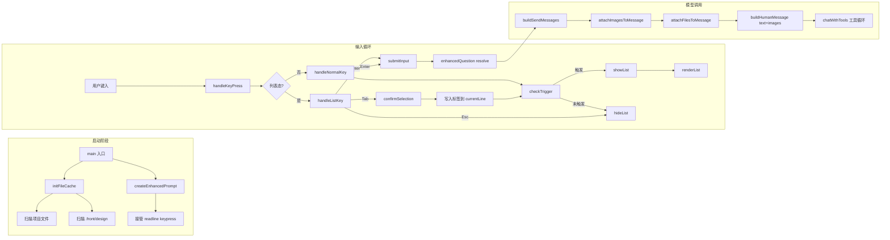
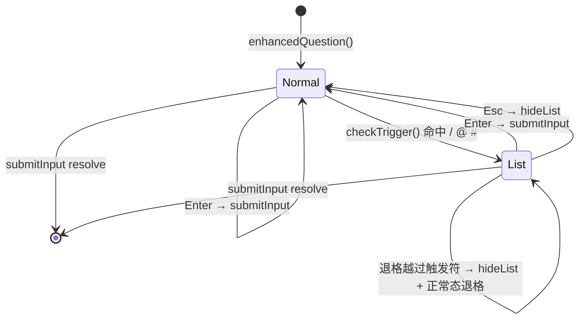
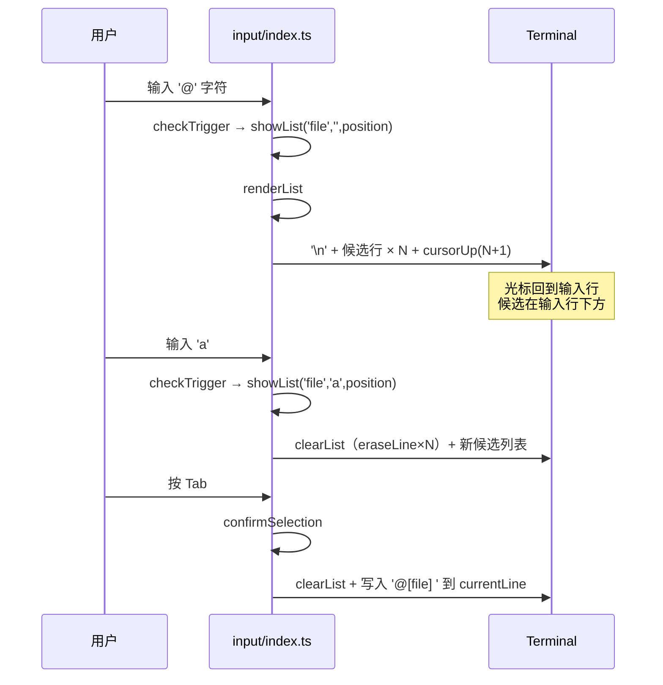
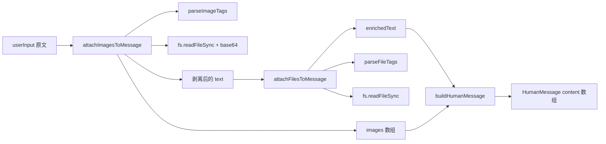

# 终端增强输入设计方案

> LC 引擎终端交互层设计：在 readline 上接管 keypress，支持 `/` `@` `#` 三个触发符弹出候选列表，并把选中的 `@[file]` 文件内容 / `#[img]` 设计图按 LangChain 多模态消息格式注入到本轮消息。
> 对应原 Plan 中的「块 A + 块 B」，补齐 Legacy 引擎（`src/input/index.js` + `src/files/index.js`）的体验能力，同时遵守 AGENTS.md §3.6 隔离红线。

---

## 一、背景与目标

LC 引擎（`src/lc/`）在迁移早期把 `src/app.js` 的 `readline + keypress` 终端增强交互整体替换为 `@inquirer/prompts#input`。结果丢失了 Legacy 引擎的两大核心手感：

1. **`/` `@` `#` 三个触发符弹候选列表**——用户键入触发符后，下方实时渲染候选列表，`↑↓` 切换、`Tab` 确认。
2. **选中的标签自动展开为可消费内容**——`@[file]` 选中后把文件内容追加到消息，`#[img]` 选中后以 `image_url` 形式发给模型。

本方案目标：

| 触发符 | 候选源 | 选中行为 |
|--------|--------|----------|
| `/` | 内置指令（`/memory` `/vector`） | 写入 `/cmdName ` 到输入行 |
| `@` | 项目文件（`excludeDirs` 排除后递归扫描） | 写入 `@[path] `，文件内容拼到消息末尾 |
| `#` | `.front/design/` 图片 | 写入 `#[img.png] `，图片以 base64 注入消息的 `image_url` |

边界：

- **不接管指令执行**：本次只做交互层与标签附件层。`/help` `/clear` `/context` `/exit` `/quit` `/a` `/ask` 这些内置指令的执行逻辑由后续单独的「指令系统回填」计划负责。
- **不接管自定义指令**：`.front/commands/<group>/*.md` 的扫描加载同样由单独的指令系统计划负责，本次 `/` 候选列表只内置当前可用的 2 条。
- **不破坏现有消息拼装**：所有改动收敛在 `prompts.ts` 末尾 3 行 + `app.ts` 入口循环 5 行。

---

## 二、整体流程



三个阶段职责分明：

| 阶段 | 模块 | 关注点 |
|------|------|--------|
| 启动 | `src/lc/input/index.ts` | 初始化文件/图片缓存、接管 keypress |
| 输入 | `src/lc/input/index.ts` | 状态机 + ANSI/chalk 渲染 |
| 模型 | `src/lc/files/index.ts` + `src/lc/prompts.ts` | 标签解析、内容附件、消息构造 |

---

## 三、文件清单与职责

### 3.1 [src/lc/files/index.ts](src/lc/files/index.ts)

**职责**：项目文件与设计图的扫描、模糊筛选、标签解析、内容附件。复刻 `src/files/index.js` 的语义，**自给自足，不引用 legacy**。

| 导出函数 | 用途 |
|---------|------|
| `scanProjectFiles(dir?, baseDir?)` | 递归扫描项目文件（默认从 `process.cwd()`），返回相对路径数组（统一正斜杠） |
| `filterFiles(files, query)` | 大小写不敏感模糊筛选 |
| `readFileContent(filepath)` | 读取文件内容，失败返回 `[无法读取文件: ...]` 占位 |
| `parseFileTags(input)` | 提取 `@[filename]` 列表 |
| `attachFilesToMessage(input)` | 把 `@[file]` 文件内容追加到文本末尾，无标签时原样返回 |
| `scanDesignImages()` | 扫描 `.front/design/` 下的图片文件名 |
| `filterImages(images, query)` | 大小写不敏感模糊筛选 |
| `parseImageTags(input)` | 提取 `#[filename]` 列表 |
| `removeImageTags(input)` | 剥离 `#[filename] ` 标签，返回纯文本 |
| `getDesignImagePath(imageName)` | 拼 `.front/design/<name>` 绝对路径 |
| `attachImagesToMessage(input)` | 把 `#[img]` 展开为 `{ text, images }`，`images` 是 `data:image/...;base64,...` 数组 |

**关键常量**：

```typescript
const excludeDirs = ['node_modules', '.git', '.front', '.claude', 'dist', 'build'];
const excludeFiles = ['.DS_Store', 'Thumbs.db'];
const imageExts = ['.png', '.jpg', '.jpeg', '.gif', '.bmp', '.webp'];
```

**mime 推断**：

```typescript
function inferMimeType(filename: string): string {
  const ext = path.extname(filename).toLowerCase();
  switch (ext) {
    case '.png':  return 'image/png';
    case '.jpg':
    case '.jpeg': return 'image/jpeg';
    case '.gif':  return 'image/gif';
    case '.bmp':  return 'image/bmp';
    case '.webp': return 'image/webp';
    default:      return 'application/octet-stream';
  }
}
```

**`@[file]` 追加格式**（与 Legacy 完全一致）：

```text
<原文>

--- 附加文件内容 ---

## <file>
```text
<file content>
```

## <file2>
```text
<file2 content>
```
```

**`#[img]` 返回结构**：

```typescript
attachImagesToMessage('参考 #[home.png] 布局')
// {
//   text: '参考 布局',
//   images: ['data:image/png;base64,iVBORw0KGgo...']
// }
```

### 3.2 [src/lc/input/index.ts](src/lc/input/index.ts)

**职责**：复刻 `src/input/index.js` 的 readline 接管 + 候选列表渲染。**自给自足**，仅依赖 `readline`（原生）、`ansi-escapes`、`chalk`、`./files/index.ts`。

| 导出函数 | 用途 |
|---------|------|
| `initFileCache()` | 调用 `scanProjectFiles()` + `scanDesignImages()` 填充缓存，`main` 入口调用一次 |
| `createEnhancedPrompt(rl)` | 移除 `rl.input` 默认 keypress 监听，装上自定义 handler |
| `enhancedQuestion(prompt)` | 返回 `Promise<string>`，循环内反复调用实现多轮提问 |

**模块级状态**（单例，因为 readline 是单例）：

```typescript
const listState: ListState = {
  visible: boolean,
  type: 'command' | 'file' | 'image' | null,
  items: Candidate[],
  selectedIndex: number,
  filterText: string,
  triggerPosition: number,   // 触发符在 currentLine 中的下标
  lastRenderedCount: number, // 上次渲染了多少条，用于 clearList 时定位光标
};
let rl: readline.Interface | null = null;
let currentLine = '';
let cursorPos = 0;
let allFiles: string[] = [];
let allImages: string[] = [];
let resolveInput: ((value: string) => void) | null = null;
```

**`/ @ #` 候选源**：

| 类型 | 来源 |
|------|------|
| `command` | `getBuiltinCommands()` 内置 2 条： `/memory`、`/vector` |
| `file` | `allFiles`（`@` 触发时全量，过滤由 `filterFiles` 实时做） |
| `image` | `allImages`（`#` 触发时全量，过滤由 `filterImages` 实时做） |

`getBuiltinCommands()` 是本次唯一「对外可替换点」，指令系统回填计划只需把这里替换成 `loadAllCommands()` 即可，零侵入。

---

## 四、状态机

### 4.1 两个态：`正常态` 与 `列表态`



**`checkTrigger` 触发规则**（三个触发符共用）：

```text
触发符前字符 ∈ {行首, 空格}
   AND
触发符之后到光标位置的子串中不含空格
```

任一条件不满足 → `hideList()`。

**优先级**：当多个触发符同时命中（极少见）时按 `/` → `@` → `#` 顺序返回。实际场景几乎不会出现冲突。

### 4.2 列表渲染

候选列表显示在输入行**下方**：



**选中后写入格式**：

| 类型 | 写入文本 |
|------|---------|
| `command` | `<before>/cmdName <after>`，光标停在命令名 + 1 后 |
| `file` | `<before>@[相对路径] <after>` |
| `image` | `<before>#[文件名] <after>` |

### 4.3 渲染原语

```typescript
// refreshLine：把 currentLine 重新写到 stdout 并把光标移回 cursorPos
function refreshLine(): void {
  process.stdout.write(ansiEscapes.cursorLeft + ansiEscapes.eraseLine);
  process.stdout.write(rl.getPrompt() + currentLine);
  const moveTo = currentLine.length - cursorPos;
  if (moveTo > 0) process.stdout.write(ansiEscapes.cursorBackward(moveTo));
}

// renderList：先换行，在新行起向下渲染 maxItems 条候选；选中的那条 chalk.bgBlue.white 高亮
// clearList：用 lastRenderedCount 精准 eraseLine，把光标回到原输入行
```

候选最多显示 **8 条**（与 Legacy 保持一致）；超出的项目文件靠实时 `filterFiles` 筛选。

---

## 五、标签内容注入（块 B）

### 5.1 注入点

唯一的注入点位于 [src/lc/prompts.ts](src/lc/prompts.ts) 末尾：

```typescript
// 旧实现
messages.push(buildHumanMessage({ text: userInput }));

// 新实现
const expanded = attachImagesToMessage(userInput);
const enrichedText = attachFilesToMessage(expanded.text);
messages.push(buildHumanMessage({ text: enrichedText, images: expanded.images }));
```

**为什么先剥图片再追加文件**：避免 `@[file]` 文件内容里出现 `#[img]` 误匹配。顺序敏感。

### 5.2 与 LangChain 多模态对接

`messages.ts#buildHumanMessage` 已预留 `images?: string[]` 参数：

```typescript
export function buildHumanMessage(options: BuildHumanMessageOptions) {
  const { text, images = [] } = options;
  if (!images || images.length === 0) {
    return new HumanMessage(text ?? "");
  }
  const content: ContentItem[] = [];
  if (text) content.push({ type: "text", text });
  for (const imgUrl of images) {
    content.push({ type: "image_url", image_url: { url: imgUrl } });
  }
  return new HumanMessage({ content });
}
```

`data:image/...;base64,...` 直接作为 `image_url.url` 传给 `ChatOpenAI`，由网关透传至多模态模型。

### 5.3 数据流



### 5.4 设计图缺失/读取失败的容错

- `parseImageTags` 列出全部 `#[img]` 标签
- 对每个标签 `fs.existsSync` 检查，缺失则跳过该张
- `fs.readFileSync` 抛错则跳过该张，**单张失败不影响整体**
- 最终 `images[]` 是「存在的图片」子集，可能为 0

---

## 六、与 Legacy 引擎的能力对照

| 维度 | Legacy（`src/input/index.js` + `src/files/index.js`） | LC 新版（`src/lc/input/index.ts` + `src/lc/files/index.ts`） | 状态 |
|------|---------------------------------------------------------|----------------------------------------------------------------------|------|
| `/` 触发指令列表 | ✅ 9 条内置 + 自定义 `.front/commands/` | ✅ 2 条内置（指令系统回填计划时扩展） | 对齐候选源机制，候选数量后续补 |
| `@` 触发文件列表 | ✅ 实时模糊筛选 | ✅ 实时模糊筛选 | **对齐** |
| `#` 触发设计图列表 | ✅ 实时模糊筛选 | ✅ 实时模糊筛选 | **对齐** |
| `↑↓` 切换 + `Tab` 确认 | ✅ | ✅ | **对齐** |
| `Esc` 关闭候选 | ✅ | ✅ | **对齐** |
| 光标移动（`←` `→`）+ 行内编辑 | ✅ | ✅ | **对齐** |
| `@[file]` 选中后追加文件内容 | ✅ `attachFilesToMessage` | ✅ `attachFilesToMessage` | **对齐** |
| `#[img]` 选中后追加图片到消息 | ✅ `parseImageTags` + `imageToBase64` | ✅ `attachImagesToMessage` | **对齐** |
| chalk 高亮 + ANSI 光标 | ✅ | ✅ | **对齐** |

---

## 七、隔离原则检查（AGENTS.md §3.6）

| 文件 | 依赖项 | 是否触碰 legacy |
|------|--------|----------------|
| `src/lc/files/index.ts` | `fs`（原生）、`path`（原生）、`../utils/pathUtils.ts` | ❌ 不引 `src/files/index.js` / `src/utils/fileHandle.js` |
| `src/lc/input/index.ts` | `readline`（原生）、`ansi-escapes`、`chalk`、`../files/index.ts` | ❌ 不引 `src/input/index.js` / `src/commands/index.js` |
| `src/lc/prompts.ts`（仅末尾 3 行） | 已有依赖 + `../files/index.ts` | ❌ |
| `src/lc/app.ts`（仅入口 5 行） | `readline`（原生）+ `../input/index.ts` | ❌，移除 `@inquirer/prompts#input` 的唯一 import |

**未触发** §3.6 的"例外"条款——所有复用都通过自给自足实现，零 legacy 依赖。

---

## 八、调用入口改动（src/lc/app.ts）

仅修改入口循环的输入来源，其它逻辑不动：

```typescript
// 移除
import { input } from '@inquirer/prompts';

// 新增
import readline from 'readline';
import { initFileCache, createEnhancedPrompt, enhancedQuestion } from './input/index.ts';

// 在 main() 内、MCP 注册之后：
initFileCache();
const rl = readline.createInterface({ input: process.stdin, output: process.stdout });
createEnhancedPrompt(rl);

// while 循环内：
const userInput = (await enhancedQuestion('问：')).trim();

// 退出循环后：
rl.close();
await disconnectAllMcp();
```

`prompts.ts` 的入参约定 `buildSendMessages(history, userInput)` 不变——「标签解析 + 内容附件」在该函数内部完成。

---

## 九、验证

### 9.1 单测

`scripts/files-smoke.ts` 覆盖 files 模块所有纯函数与文件 I/O 路径：

| 用例 | 验证点 |
|------|--------|
| `parseFileTags` 多标签 | 正则正确提取 |
| `parseImageTags` + `removeImageTags` | 解析 + 剥离正确 |
| `filterFiles` 模糊匹配 | 大小写不敏感 |
| `filterImages` 扩展名筛选 | 命中唯一 |
| `attachFilesToMessage` 真实文件 | 追加 `## file` 代码块 |
| `attachImagesToMessage` 真实 PNG | base64 编码 + mime 推断 |
| `readFileContent` 错误处理 | 返回占位字符串 |
| `attachFilesToMessage` 无标签 | 原样返回 |

**结果**：14/14 PASS。

### 9.2 端到端启动冒烟

`scripts/app-smoke.ts`：spawn `npx tsx ./src/lc/app.ts`，1.5s 后通过 stdin 注入 `exit\n`，验证：

- `initFileCache` 不抛错
- `readline.createInterface` + `createEnhancedPrompt` 不抛错
- `enhancedQuestion('问：')` 不抛错
- `exit` 命令正常退出，进程 `code=null`（无错误）

### 9.3 typecheck

`npx tsc --noEmit` → 0 错误。`@types/node@26` 下 `readline.Interface.input` 通过 `(rl as unknown as { input: NodeJS.ReadableStream }).input` 绕过类型暴露差异。

### 9.4 手动验证（建议用户跑一次）

```bash
npx tsx ./src/lc/app.ts
```

| 操作 | 预期 |
|------|------|
| 输入 `/` | 弹出 `/memory` `/vector` 两条候选，`↑↓` 切换高亮，`Tab` 写入 |
| 输入 `@src/lc/a` | 弹出 `src/lc/app.ts` 候选，`Tab` 选中后回车，AI 收到的消息含 `## src/lc/app.ts` 追加段 |
| 放入 `.front/design/test.png`，输入 `#test` | 弹出候选，`Tab` 选中后回车，AI 收到的消息 `content` 数组含 `image_url.data:image/png;base64,...` |
| 直接 Enter | 跳过本轮，继续输入 |
| `backspace` 退到行首 | 不崩，候选列表关闭 |
| `Ctrl+C` | MCP 子进程清理后退出 |

---

## 十、风险与边界

| 风险 | 缓解 |
|------|------|
| `chalk` / `ansi-escapes` 已在 `package.json`（legacy 阶段安装），升级版本可能引起 API 变化 | 当前版本已锁定，无需新增依赖 |
| `readline.Interface.input` 在不同 `@types/node` 版本中类型暴露不同 | 通过 `unknown` cast 绕过；运行时无差异 |
| 设计图 base64 使单次请求体积膨胀 | 与 Legacy 一致，本次不做大小限制；后续如需要可在 `attachImagesToMessage` 内增加 `MAX_IMAGE_BYTES` 截断 |
| `/` 候选只有 2 条，指令系统回填前体验弱 | 已标注为指令系统回填计划的责任；候选源是 `getBuiltinCommands()` 一个函数，替换零侵入 |
| `rl.close()` 顺序 | 放在 `disconnectAllMcp` 之前，避免 stdio MCP 子进程在 readline 还占用 stdin 时被强制断连 |
| 启动阶段 `initFileCache` 阻塞 | `scanProjectFiles` 在大型 monorepo（数千文件）下可能耗时 100ms+；本次不优化，启动期同步执行即可，后续可改为后台 lazy 加载 |

---

## 十一、后续衔接

| 计划 | 与本计划的边界 |
|------|----------------|
| 指令系统回填（块 C） | 替换 `getBuiltinCommands()` 为 `loadAllCommands()`；指令执行逻辑由该计划负责 |
| 设计图大小限制 | 改 `attachImagesToMessage` 单点即可 |
| `@` 触发懒加载 | 改 `initFileCache` 为 lazy + watcher |
| 候选列表视觉升级（分页/分组） | 改 `renderList` + 列表态按键 handler |

---

> **文档结束** · 本设计覆盖「块 A + 块 B」全部交付，typecheck 0 错误、files-smoke 14/14、app-smoke 端到端启动通过。
