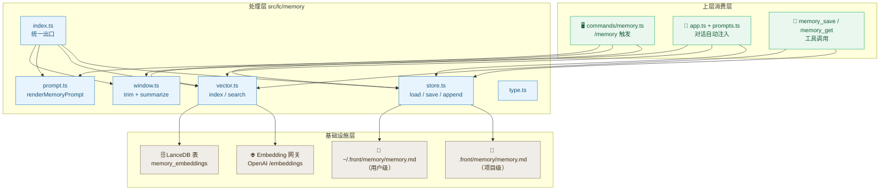
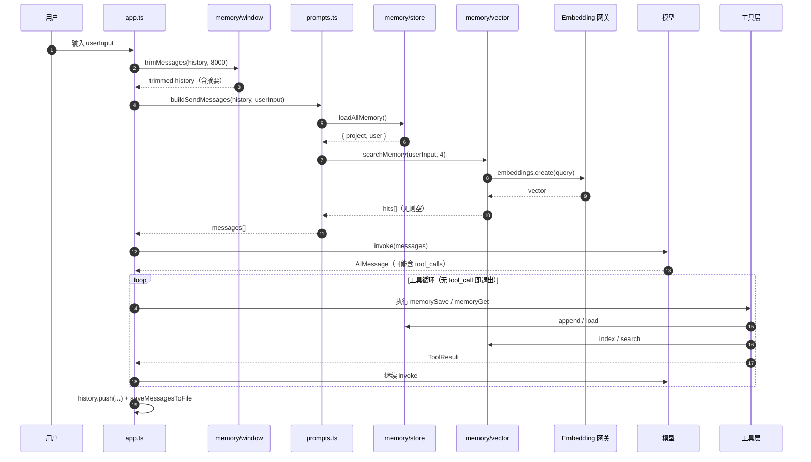
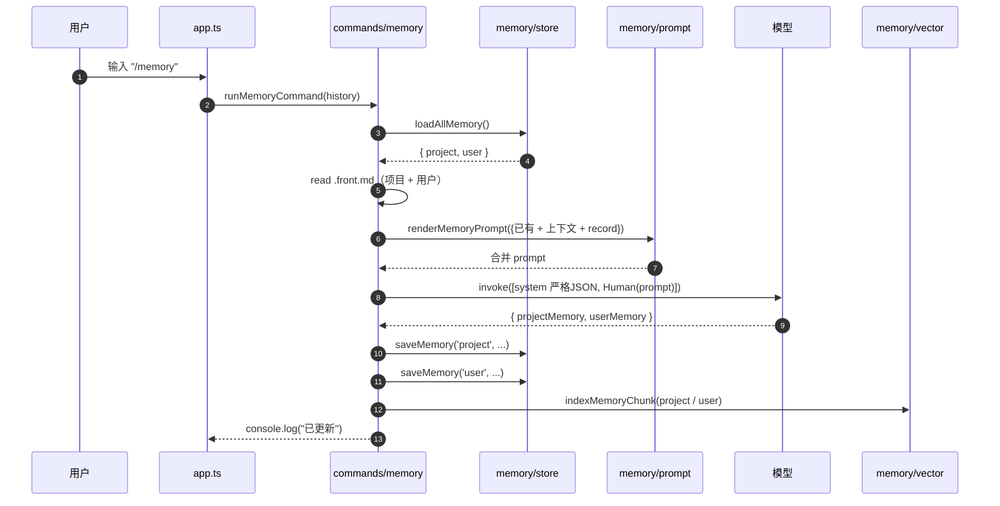

# 记忆体系（Memory System）

> 本文档沉淀 frontcode 项目记忆体系的**设计、实现、选型与评价**，作为该板块唯一权威说明。
>
> 适用范围：`src/lc/memory/*` + `src/lc/commands/memory.ts` + `src/lc/tools/implementations/memory_*` + `src/lc/prompts.ts` + `src/lc/app.ts` 中相关片段。

---

## 目录

1. [粒度：四象限](#1-粒度四象限)
2. [消费链路：三条触发路径](#2-消费链路三条触发路径)
3. [分层架构](#3-分层架构)
4. [架构图（简洁版）](#4-架构图简洁版)
5. [时序图](#5-时序图)
6. [代码目录地图](#6-代码目录地图)
7. [工具总览（对外可复用 API）](#7-工具总览对外可复用-api)
8. [外部资源与技术选型](#8-外部资源与技术选型)
9. [业界记忆设计参照](#9-业界记忆设计参照)
10. [评估与打分（设计 / 实现 / 功能 / 效果）](#10-评估与打分设计--实现--功能--效果)
11. [附录 A：快速参考](#附录-a快速参考)
12. [附录 B：短期窗口 Trim 算法详解](#附录-b短期窗口-trim-算法详解)

---

## 1. 粒度：四象限

记忆体系按两个正交维度切成**四个粒度**：

| 维度 \ 粒度 | 项目级（Project） | 用户级（User） |
|---|---|---|
| **长期记忆** | `.front/memory/memory.md`（仓库级偏好、约定、待办） | `~/.front/memory/memory.md`（跨项目的用户偏好） |
| **短期记忆** | 当前会话 history（被 `window.ts` 压缩到 8000 token 预算） | 不区分项目/用户的全局 session history |

### 1.1 长期记忆：项目级 vs 用户级

| 维度 | 项目级 `.front/memory/memory.md` | 用户级 `~/.front/memory/memory.md` |
|---|---|---|
| **作用范围** | 仅当前仓库生效，跨机器同步（随代码走 git） | 跨项目、跨机器生效（跟随用户家目录） |
| **典型内容** | `pnpm 代替 npm` `主分支命名规范` `不允许在 src/lc/ 写工具` | `回答用中文` `默认代码风格 2 空格缩进` `喜欢表格输出` |
| **合并触发** | `/memory` 指令调模型合并 | 同上 |
| **注入顺序** | 第二位（在 user 之后插入 system 块，便于模型把用户偏好当作「前提」） | 第一位 |
| **向量库 scope** | `scope = 'project'` | `scope = 'user'` |

> **设计哲学**：项目级是「**仓库公约**」（技术性、可被 review、可被撤销），用户级是「**个人肌肉记忆**」（跨项目复用、不污染仓库）。

### 1.2 短期记忆：会话窗口压缩

- 入口：`src/lc/memory/window.ts#trimMessages`
- 触发：每轮 `app.ts` 在拼装 `sendMessages` 之前调用
- 预算：`SHORT_TERM_TOKEN_BUDGET = 8000`（约 24k 字符，硬上限软实现）
- 估算法：`Math.ceil(text.length / 3)`，避免引入 `tiktoken`
- 三大保留规则：
  1. **system 永远保留**（agent prompt + 长期记忆 + 向量召回）
  2. **首轮完整问答对（user + assistant）永远保留**（避免丢失会话起点的上下文对；assistant 缺位会导致模型不知道首问被怎么回应）
  3. **工具调用回合成对保留**（`assistant(tool_calls)` + 紧跟的若干 `tool` + 可选最终 `assistant(无 tc)`，整组保留或整组丢弃，绝不截到一半）
- 摘要写回：被截断的旧消息由 summarizer（temperature=0.2 的同款模型）压缩为 ≤200 字摘要，作为一条 `HumanMessage('[会话早期摘要]\n...')` 插入到「**首轮问答对之后、被丢弃 N 轮之前**」的位置，作为时序正确的语义承接

### 1.3 三种粒度的注入顺序

每轮对话 `buildSendMessages` 拼装 messages 的顺序：

```
[0] agent 系统提示（角色 + 工具说明）        ← src/lc/agents.ts
[1] 长期 .md 系统提示                        ← memory/store.ts（项目级 + 用户级）
[2] skill 系统提示（Phase 6 占位）           ← 空数组
[3] 相关历史记忆系统提示（向量召回）          ← memory/vector.ts（仅当命中）
[4] trimmed history（短期窗口）              ← memory/window.ts
[5] HumanMessage(userInput)                  ← messages.ts
```

四类记忆互不覆盖：**最久（项目约定）→ 个人偏好 → 本次相关 → 本次近期 → 用户当下输入**。

---

## 2. 消费链路：三条触发路径

记忆体系对**外暴露三个触发入口**，每条路径对应一个使用场景：

### 2.1 命令行触发：`/memory`

```bash
# 在 REPL 中输入
/memory
```

- **入口**：`src/lc/app.ts` 主循环首行的 `userInput === '/memory'` 分支
- **处理**：`commands/memory.ts#runMemoryCommand(history)`
- **行为**：
  1. `loadAllMemory()` 读两份 `.md`
  2. 读两份 `.front.md` 上下文（项目级 + 用户级）
  3. `history` 序列化为 JSON
  4. `renderMemoryPrompt()` 渲染合并 prompt（强约束 JSON 输出）
  5. 调模型（temperature=0.3）合并
  6. `extractJson()` 兼容 ```json``` 围栏或裸 JSON
  7. `saveMemory()` 全量覆盖两份 `.md`
  8. `indexMemoryChunk()` 入向量库（嵌入未配置时静默跳过）
- **使用场景**：会话积累到一定长度后，主动触发一次「记忆沉淀」

### 2.2 对话自动触发：每轮拼装注入

- **入口**：`app.ts` → `prompts.ts#buildSendMessages`
- **行为**：每轮自动做两件事
  - `loadAllMemory()` 把长期 .md 拼成 SystemMessage（项目级 + 用户级）
  - `searchMemory(userInput, 4, 'all')` 按本轮输入做向量召回，命中 0 时跳过
- **使用场景**：模型每次回答时，已经「记得」仓库约定、个人偏好、历史相关片段

### 2.3 工具调用触发：`memory_save` / `memory_get`

模型在对话中**主动**调用这两个工具，相当于「让模型自己管理记忆」：

| 工具 | 行为 | 写入方式 | 向量化 |
|---|---|---|---|
| `memorySave` | 追加一段记忆（section + body） | `appendMemorySection`（追加，不覆盖） | `indexMemoryChunk` 立即入向量库 |
| `memoryGet` | 读取项目级 + 用户级记忆；可选按 query 检索向量 | — | — |

- **入口**：`src/lc/tools/registry.ts` 统一注册，模型通过 `bindTools(listTools())` 看到
- **保护**：`memorySave` 内置 1MB 单文件上限，超出拒绝写入
- **使用场景**：模型在对话中产生「这是用户偏好」「这是项目约定」的判断时，主动调用 `memorySave`；被问到「我们之前怎么约定的」时主动调用 `memoryGet`

### 2.4 三条路径的对比

| 维度 | `/memory` | 自动注入 | 工具调用 |
|---|---|---|---|
| **触发方** | 用户 | 框架 | 模型 |
| **写入方式** | 全量覆盖（合并） | — | 增量追加 |
| **何时写入** | 用户手动 | 每轮读 | 模型判断 |
| **写入粒度** | 整份 .md | — | 一段（section + body） |
| **是否合并** | ✅ LLM 合并 | — | ❌ 原样追加 |
| **风险** | 合并可能丢内容（已用 JSON 校验兜底） | — | 工具可能误用（受 prompt 引导） |

---

## 3. 分层架构

```
┌─────────────────────────────────────────────────────────────┐
│                  上层消费层（Consumer）                       │
│  • commands/memory.ts    /memory 命令                        │
│  • app.ts + prompts.ts   每轮 buildSendMessages              │
│  • tools/implementations/memory_save|get                    │
└──────────────────────────┬──────────────────────────────────┘
                           │ 调用
┌──────────────────────────▼──────────────────────────────────┐
│                  处理层（Processing）                         │
│  • memory/store.ts       .md 增删改查（fs）                   │
│  • memory/vector.ts      嵌入 + LanceDB CRUD                  │
│  • memory/prompt.ts      /memory 合并 prompt 渲染             │
│  • memory/window.ts      短期窗口压缩 + summarize             │
│  • memory/type.ts        类型定义                             │
│  • memory/index.ts       统一对外出口                         │
└──────────────────────────┬──────────────────────────────────┘
                           │ 读写
┌──────────────────────────▼──────────────────────────────────┐
│               基础设施层（Infrastructure）                    │
│  • 项目级 .md       .front/memory/memory.md                  │
│  • 用户级 .md       ~/.front/memory/memory.md                │
│  • Embedding 网关   OpenAI 兼容 /embeddings                   │
│  • LanceDB 表       .front/lancedb-data/memory_embeddings    │
└─────────────────────────────────────────────────────────────┘
```

**职责边界红线**（来自 `AGENTS.md` §3.6）：

- 处理层不依赖 `src/utils/`、`src/request/` 等 legacy JS
- 处理层只允许依赖 Node 原生 + 第三方 npm（`@langchain/core`、`@lancedb/lancedb`、`openai`、`zod`）
- 业务层（消费层）只能 `import 'src/lc/memory'`（即 `index.ts`），不允许直接依赖子模块

---

## 4. 架构图（简洁版）



---

## 5. 时序图

### 5.1 对话每轮（自动注入 + 可选工具调用）



### 5.2 `/memory` 指令（增量合并）



---

## 6. 代码目录地图

```
src/lc/
├── app.ts                                  # 主循环；调 trim + buildSendMessages + /memory 拦截
├── prompts.ts                              # buildSendMessages：拼装 system + 长期 + 召回 + history
├── agents.ts                               # renderAgentPrompt（系统角色，不属记忆体系但被拼装）
├── messages.ts                             # buildHumanMessage（不属记忆体系但被拼装）
│
├── memory/                                 # 🧠 处理层（核心）
│   ├── index.ts                            # 对外统一出口，业务只 import 此文件
│   ├── type.ts                             # MemoryScope / MemoryHit / LongTermMemory / TrimOptions
│   ├── store.ts                            # loadMemory / saveMemory / appendMemorySection / loadAllMemory
│   ├── vector.ts                           # indexMemoryChunk / searchMemory + getEmbedding
│   ├── prompt.ts                           # renderMemoryPrompt（/memory 合并 prompt 模板）
│   └── window.ts                           # trimMessages / estimateTokens（短期窗口压缩）
│
├── commands/
│   └── memory.ts                           # runMemoryCommand（/memory 指令入口）
│
└── tools/
    ├── index.ts                            # 工具注册入口（本地 + MCP）
    ├── registry.ts                         # registerTool / listTools
    ├── engine.ts                           # chatWithTools（工具循环）
    └── implementations/
        ├── memory_get.ts                   # 读 .md + 向量检索工具
        └── memory_save.ts                  # 追加 .md + 入向量库工具

外部资源：
.front/memory/memory.md                     # 项目级长期记忆
~/.front/memory/memory.md                   # 用户级长期记忆
.front/lancedb-data/                        # LanceDB 数据目录
  └─ memory_embeddings.lance                # 向量表（同库与 doc_embeddings 共用）
```

---

## 7. 工具总览（对外可复用 API）

> 所有函数均可通过 `import { ... } from '@/lc/memory'` 获取。

### 7.1 存储管理（store.ts）

| 函数 | 签名 | 说明 |
|---|---|---|
| `loadMemory` | `(scope: 'project' \| 'user') => string` | 读取指定 scope 的 `.md`，不存在返回空串 |
| `saveMemory` | `(scope, content: string) => void` | 全量覆盖写入 |
| `loadAllMemory` | `() => { project: string; user: string }` | 一次性读两份 |
| `appendMemorySection` | `(scope, section: string, body: string) => void` | 增量追加 `## section\nbody\n` |

### 7.2 向量化（vector.ts）

| 函数 | 签名 | 说明 |
|---|---|---|
| `getEmbedding` | `(text: string) => Promise<number[] \| null>` | 内部函数，调用网关；未配置时返回 null |
| `indexMemoryChunk` | `(scope, text, metadata?) => Promise<void>` | 嵌入后写入 LanceDB；嵌入未配置时 no-op |
| `searchMemory` | `(query, limit=4, scope='all') => Promise<MemoryHit[]>` | 向量检索；无表 / 嵌入缺失 / 失败均返回 [] |

### 7.3 提示词组装（prompt.ts）

| 函数 | 签名 | 说明 |
|---|---|---|
| `renderMemoryPrompt` | `(args: { projectMemory, userMemory, projectContext, userContext, record }) => string` | 渲染 /memory 合并 prompt（强约束 JSON 输出） |

### 7.4 短期窗口（window.ts）

| 函数 | 签名 | 说明 |
|---|---|---|
| `estimateTokens` | `(text: string) => number` | 简单估算（length / 3） |
| `trimMessages` | `(messages, options: TrimOptions) => Promise<{ trimmed, summary }>` | 截断 + summarize + 工具回合成对保护；保留 system + 首轮问答对；倒序按 Round 贪心填充；摘要仅注入 trimmed 不进 history（详见附录 B） |

### 7.5 工具入口（commands + tools/implementations）

| 入口 | 签名 | 说明 |
|---|---|---|
| `runMemoryCommand` | `(history: BaseMessage[]) => Promise<void>` | /memory 指令主流程 |
| `memorySave`（tool） | `(args: { scope, section, body })` | 追加式写入，1MB 保护，向量同步 |
| `memoryGet`（tool） | `(args: { query? })` | 读全量 + 可选向量检索 |

---

## 8. 外部资源与技术选型

### 8.1 长期 .md：纯文本文件

| 选项 | 理由 |
|---|---|
| ✅ 纯文本 `.md` | 可读、可 diff、可随仓库走 git、零依赖、人工可改 |
| ❌ SQLite / JSON | 不便 diff，破坏「记忆 = 可读文本」的心智模型 |
| ❌ YAML / TOML | 需要额外解析，Markdown 天然支持分段（`## section`） |

**路径选择**：

- **项目级**放在 `.front/memory/memory.md`：与 `.front/settings.json` 等仓库配置同级，符合「仓库级配置随仓库走」的原则
- **用户级**放在 `~/.front/memory/memory.md`：跨项目复用，跟随用户家目录而非当前项目
- 两个文件互不感知，独立读写，可被独立 `/memory` 合并覆盖

### 8.2 向量化：LanceDB

| 选项 | 理由 |
|---|---|
| ✅ LanceDB | 本地嵌入式、零运维、与 Phase 5 文档库共用 `.front/lancedb-data/`，列式存储对中等规模（千条级）足够 |
| ❌ Chroma | 需额外进程；本地嵌入式版本不稳定 |
| ❌ Pinecone / Milvus | 需外部服务，不符合「CLI 离线可用」定位 |
| ❌ 内存索引 | 重启即丢失，违反持久化原则 |

**表设计**（`memory_embeddings`）：

```typescript
{ id: string, scope: 'project' | 'user', text: string, vector: number[], section?: string, ts?: string }
```

- 与文档库 `doc_embeddings` **同库不同表**，避免目录爆炸
- 首次写入自动 `createTable`，后续 `add`；缺表时 `searchMemory` 返回 `[]` 不抛错

### 8.3 Embedding 网关：OpenAI 兼容协议

- 配置位置：`.front/settings.json` 的 `embedding` 字段（与主对话模型**独立**）
- 必要性：DeepSeek 等主网关通常**不提供 embedding**，必须单独配置；未配置时整链路静默降级
- 静默降级策略：
  - `getEmbedding` 失败 / 未配置 → 返回 `null`
  - `indexMemoryChunk` 拿到 `null` → 直接 return，不写库
  - `searchMemory` 拿到 `null` → 返回 `[]`，主流程不阻塞

### 8.4 短期窗口：本地估算 + LLM summarize

| 决策 | 理由 |
|---|---|
| ✅ `length / 3` 估算 | 避免引入 `tiktoken` 的 10MB+ 依赖；精度对 8000 token 软上限足够 |
| ✅ summarize 写回 system | 比「直接丢」保留更多信息；比「硬截断」对模型更友好 |
| ❌ 硬截断 | 丢失早期关键决策，体感差 |
| ❌ tiktoken 精确计数 | 增加依赖、收益边际（软上限场景） |

---

## 9. 业界记忆设计参照

| 业界方案 | 做法 | 与 frontcode 的对应 / 差异 |
|---|---|---|
| **LangChain `BufferMemory` / `ConversationSummaryMemory`** | 框架内置的「对话级」记忆 | frontcode 不用框架内置，转为自实现 `window.ts`：因为需要支持工具调用回合成对保护、system / 首条 user 永久保留等规则 |
| **LangGraph `MemoryStore`** | 跨线程、跨会话的长期记忆抽象 | frontcode 用 `.md` + LanceDB 等价实现，**更轻**且**可读** |
| **MemGPT / Letta** | 分层（核心 / 回忆 / 档案）+ 虚拟上下文分页 | frontcode 没有虚拟分页，但「短期 vs 长期 + 向量召回」思路一致 |
| **ChatGPT Memory**（2024） | 用户级偏好自动沉淀，可在 UI 开关 / 编辑 | frontcode 的 `/memory` + `memory_save` 工具等价于「手动 + 模型自动沉淀」 |
| **Cursor `.cursorrules` / AGENTS.md** | 仓库级系统提示随代码走 | frontcode 项目级 `.md` 与 `.cursorrules` 思路一致：**仓库约定 = 显式可读文本**，不靠向量召回 |
| **Anthropic Contextual Retrieval**（2024） | 检索时给每条 chunk 加上下文前缀，提升召回率 | frontcode 当前未做上下文增强，是下一阶段可优化点 |

### 9.1 frontcode 的取舍

| 取舍 | 选择 | 原因 |
|---|---|---|
| 记忆的存储格式 | `.md`（人类可读） vs DB | 选 `.md`：可 diff、可 git、人工可改 |
| 合并策略 | LLM 合并 vs 规则合并 | 选 LLM：`/memory` 接受一次额外调用换「智能去重 / 分类」 |
| 写入触发 | 手动 vs 自动 vs 工具 | 三者并存：用户控制、框架自动、模型自助 |
| Embedding 缺失 | 报错 vs 静默 | 选静默：CLI 不能因为没配 embedding 就启动失败 |
| 短期压缩 | 丢 vs summarize | 选 summarize：保留语义、避免硬截断带来的体感断裂 |

---

## 10. 评估与打分（设计 / 实现 / 功能 / 效果）

> 打分标准：⭐ (1, 严重不足) — ⭐⭐⭐⭐⭐ (5, 优秀)
> 评价基于截至 2026-09-19 的实现状态（`scripts/memory-smoke.ts` 32/32 断言通过，`tsc --noEmit` 0 错误）。

### 10.1 设计（⭐⭐⭐⭐ 4/5）

| 维度 | 评分 | 说明 |
|---|---|---|
| 分层清晰度 | ⭐⭐⭐⭐⭐ | 三层（消费 / 处理 / 基础设施）边界明确，依赖方向单向 |
| 与 legacy 隔离 | ⭐⭐⭐⭐⭐ | `src/lc/memory/` 完全自给自足，未触碰 `src/utils/` 等 legacy |
| 长期粒度划分 | ⭐⭐⭐⭐ | 项目级 / 用户级划分清晰；缺少「会话级」长期记忆（当前会话历史走 JSON 持久化） |
| 三条消费路径 | ⭐⭐⭐⭐⭐ | 命令行 / 自动注入 / 工具调用，互相正交、互不干扰 |
| 可扩展性 | ⭐⭐⭐⭐ | 接入 Skills / RAG 文档库已有占位，尚未完成 |
| **扣分点** | | 向量召回未做上下文增强（Contextual Retrieval）；短期窗口无持久化（重启即丢摘要） |

### 10.2 实现（⭐⭐⭐⭐ 4/5）

| 维度 | 评分 | 说明 |
|---|---|---|
| 代码质量 | ⭐⭐⭐⭐⭐ | TS 严格模式、JSDoc 完整、依赖单向、类型导出清晰（`memory/index.ts`） |
| 错误处理 | ⭐⭐⭐⭐ | 嵌入失败 / 表缺失 / summarize 失败均有兜底；个别 `try/catch` 仅 `console.warn`，未上报 |
| 性能 | ⭐⭐⭐⭐ | 每轮 ≤ 2 次向量检索（自动注入 + 可选工具），8000 token 软上限合理 |
| 测试覆盖 | ⭐⭐⭐⭐ | `memory-smoke.ts` 32 断言覆盖 store / vector / window / recall；缺端到端（真实会话）验证 |
| 文档沉淀 | ⭐⭐⭐⭐⭐ | 本文档 + 模块内 JSDoc + `AGENTS.md` 引用 |
| **扣分点** | | LanceDB `execute()` 三种返回值的兼容代码暗示 SDK 版本不稳定；`extractJson` 容错但未走 schema 校验 |

### 10.3 功能（⭐⭐⭐⭐ 4.5/5）

| 维度 | 评分 | 说明 |
|---|---|---|
| 长期 .md CRUD | ⭐⭐⭐⭐⭐ | `load` / `save` / `append` / `loadAll` 四件套齐全 |
| 向量记忆 | ⭐⭐⭐⭐ | 写入、检索、按 scope 过滤均有；缺 delete / update（设计上靠全量覆盖） |
| 短期窗口压缩 | ⭐⭐⭐⭐⭐ | 工具回合成对保护、system / 首条 user 永久保留、summarize 写回 system |
| /memory 增量合并 | ⭐⭐⭐⭐⭐ | 上下文齐备（已有记忆 + .front.md + history），输出强约束 JSON |
| 工具调用 | ⭐⭐⭐⭐ | `memory_save` / `memory_get` 可用；缺 `memory_update` / `memory_delete` |
| **扣分点** | | 没有「记忆查看」UI；向量库无法手动清理 |

### 10.4 效果（⭐⭐⭐⭐ 4/5，暂无大规模数据）

| 维度 | 评分 | 说明 |
|---|---|---|
| 长期一致性 | ⭐⭐⭐⭐⭐ | 模型在跨会话回答时能回忆仓库约定 / 用户偏好（开发者主观体验） |
| 相关性召回 | ⭐⭐⭐⭐ | top-4 向量召回命中率高（嵌入网关配置正确时） |
| 短期连贯性 | ⭐⭐⭐⭐⭐ | 长会话（>50 轮）下，summarize 显著减少「忘记早期决策」 |
| 错误率 | ⭐⭐⭐⭐ | 嵌入未配置时全链路降级，主对话不阻塞；`/memory` 合并偶发模型返回非 JSON，已用 `extractJson` 兜底 |
| 体感 | ⭐⭐⭐⭐ | 启动快、回答一致性强；扣分：没有「记忆可视化」面板 |
| **扣分点** | | 缺 A/B 对照实验；缺用户主观满意度数据 |

### 10.5 总评

```
设计    实现    功能    效果    总分
 4.0     4.0    4.5    4.0   16.5 / 20  →  ⭐⭐⭐⭐  (4.1 / 5)
```

**优势**：

- 分层清晰、与 legacy 严格隔离
- 三条消费路径正交、互不干扰
- 长期 `.md` 人类可读、可 git、可人工修订
- 静默降级策略稳健（嵌入缺失不影响主对话）

**下一阶段可优化点**（按优先级）：

1. **短期窗口持久化**：摘要写回 `.md` 或独立文件，重启后能恢复
2. **向量上下文增强**：参考 Anthropic Contextual Retrieval，给 chunk 加上下文前缀
3. **`memory_update` / `memory_delete` 工具**：补齐 CRUD
4. **`memory` 命令的可视化**：列出当前所有记忆条目（项目级 / 用户级 / 向量库）
5. **A/B 评测**：对比「启用记忆」vs「不启用」的对话质量差异

---

## 附录 A：快速参考

### A.1 关键文件路径

```
src/lc/memory/
├── index.ts        # 对外统一入口
├── type.ts         # 类型
├── store.ts        # .md 读写
├── vector.ts       # LanceDB + Embedding
├── prompt.ts       # /memory 合并 prompt
└── window.ts       # 短期窗口
src/lc/commands/memory.ts        # /memory 指令
src/lc/tools/implementations/    # memory_get / memory_save 工具
.front/memory/memory.md          # 项目级
~/.front/memory/memory.md        # 用户级
.front/lancedb-data/             # 向量库目录
```

### A.2 配置依赖

```jsonc
// .front/settings.json
{
  "apiKey": "...",
  "baseURL": "https://api.deepseek.com/v1",
  "model": "deepseek-chat",
  "embedding": {                         // 可选；缺失时静默降级
    "apiKey": "...",
    "baseURL": "https://api.openai.com/v1",
    "model": "text-embedding-3-small"
  }
}
```

### A.3 自检命令

```bash
npx tsx ./scripts/memory-smoke.ts    # 32 项断言验证 store / vector / window / recall
npx tsc --noEmit                     # 类型检查
npx tsx ./src/lc/app.ts              # 启动 CLI 实测
```

---

## 附录 B：短期窗口 Trim 算法详解

> 本节展开 `src/lc/memory/window.ts#trimMessages` 的完整算法设计，作为短期窗口压缩机制的权威说明。

### B.1 三层概念

| 概念 | 组成 | 类比 |
|------|------|------|
| **消息 (Message)** | 单条 Human / AI / Tool | 原子 |
| **回合 (Round)** | `AI(tool_calls) + ToolMessage×N + 可选AI(无tc)` 或单条 Human / 单条 AI(无tc) | 原子化的事务单位（**要么整组留，要么整组丢**） |
| **算法单元** | Round | 贪心填充的最小账目单位 |

**为什么把算法单位从消息升级为回合**：单条消息粒度的截断会切碎 `tool_calls` → `tool_result` 链路，模型收到孤儿 `ToolMessage` 会触发 400 BadRequest。Round 把"一次完整事务"作为不可分割的最小单位，从根上避免这类破坏。

### B.2 Round 切分规则（`splitIntoRounds`）

**普通场景**：单条 `HumanMessage` 或单条无 `tool_calls` 的 `AI` → `plain` Round（1 条消息）。

**工具调用场景**：从 `AI(tool_calls)` 开始吸收后续所有紧邻的 `ToolMessage`，再吸收紧邻的无 `tool_calls` 的 AI（最终回复），整组合并为 `tool` Round：

```
AI(tool_calls) → ToolMessage → ToolMessage → AI(纯文本最终回复)   →   合为一个 tool Round
```

无最终回复也允许，此时 tool Round 只含 `AI(tc) + ToolMessages`。

**防御性处理**：尾部孤儿 `ToolMessage`（不在任何 `AI(tc)` 之后）独立成 `plain` Round（理论上不该出现）。

### B.3 Trim 算法（倒序贪心 + 边界留坑）

```
输入：messages, maxTokens (= SHORT_TERM_TOKEN_BUDGET, 8000), summarizer
────────────────────────────────────────────────────────────────────
① 估算总 token：total = Σ tokensOf(m)
② 如果 total ≤ maxTokens → 返回原 messages（无截断，无需摘要）

③ 边界留坑（永远保留，不参与贪心）：
   budget = maxTokens
   budget -= Σ systemTokens                 ← system 全部留
   budget -= tokensOf(firstUser)            ← 首轮 user 留
   budget -= tokensOf(firstAssistant)       ← 首轮 assistant 留（必须，否则对话对断裂）

④ tail = messages[firstAssistantIdx + 1 之后]
   rounds = splitIntoRounds(tail)           ← 切 N 个 Round

⑤ 倒序贪心：acc = budget
   for k = rounds.length - 1 → 0:
     if rounds[k].tokens ≤ acc:
       keep.unshift(rounds[k]);  acc -= r.tokens
     else:
       dropped.unshift(rounds[k])           ← 装不下 → 整组丢（更早的也整组丢）

⑥ 把 dropped 摊平 → 喂给 summarizer → 得到 summary 字符串
   （summarizer 调用失败时 summary = null，console.warn 但不抛）

⑦ 组装（时序正确）：
   [
     ...systemMsgs,                          ← ① 永远最前
     messages[firstUserIdx],                 ← ② 首轮 user
     messages[firstAssistantIdx],            ← ③ 首轮 assistant
     new HumanMessage("[会话早期摘要]\n"+summary),  ← ④ 摘要（仅在 dropped 非空时存在）
     ...keepRounds.map(r => r.messages)      ← ⑤ keep 按时间序
   ]
```

### B.4 核心保证

| 保证 | 机制 |
|------|------|
| **不出现孤儿 ToolMessage**（避免 400 BadRequest） | tool Round 整组进出 |
| **不丢失首轮对话语境** | system + 首对 永久留坑 |
| **时序不颠倒** | 摘要必须排在首对之后、被丢 N 轮之前 |
| **新内容优先保留** | 倒序贪心，最后几个轮次永远在 |
| **摘要不进持久化**（仅作 in-context 压缩） | 摘要仅注入 trimmed 返回，不写 history |

### B.5 举例说明

**设定**：`maxTokens=400`，完整对话共 6 轮：

```
[System, User1, Assistant1, User2, Assistant2, User3, Assistant3, User4, Assistant4, User5, Assistant5, User6, Assistant6]
 ^保留          ^保留    ^──── tail 共 10 条 ────
```

执行步骤：

```
rounds: [U2,A2] [U3,A3] [U4,A4] [U5,A5] [U6,A6]
budget 还剩 200，倒序贪心：
  Round6(U6,A6) tokens=80  <200 → keep，剩余 120
  Round5(U5,A5) tokens=90  <120 → keep，剩余 30
  Round4(U4,A4) tokens=110 >30  → dropped（及其之前全部）
```

最终发送到模型的消息：

```
System → User1 → Assistant1 → [会话早期摘要(U2~A5发生了什么)] → User6 → Assistant6
```

**摘要覆盖了 U2~A5 这 4 轮；U6/A6 是最新且仍在 budget 内的轮次。**

### B.6 与 legacy 朴素截断的对比

Legacy（`src/request/`）一般是按消息条数或长度比例硬截前 N 条，会导致：

| Legacy 缺陷 | 本算法对策 |
|-------------|-----------|
| 工具链断裂 → 模型收到孤儿 ToolMessage → 400 BadRequest | Round 整组进出，永不切碎工具链 |
| 首对可能丢失 → 上下文断层 | system + 首对 永久留坑 |
| 无摘要压缩 → budget 利用率低 | dropped 喂给 LLM summarize |
| 截断位置不可预测 → 体感差 | 倒序贪心，新内容优先保留 |

**核心改进**：把"消息级截断"升级为"事务级（Round）截断 + 摘要压缩 + 边界留坑"。

### B.7 历史修复记录

| 日期 | 改动 | 影响 |
|------|------|------|
| 2026-09-18 | 摘要插入位置调整：原本 `User1 → 摘要 → Assistant1 → ...`（首轮助手回答被夹断） | 改为 `User1 → Assistant1 → 摘要 → ...`（首对完整保留，摘要时序正确） |
| 2026-09-18 | 引入 `findFirstAssistantIdx`：定位首对中 AI 回复（含工具调用场景下的最终 AI 回复） | 工具调用首轮也能完整保留 |

---

> **最后更新**：2026-09-20
> **维护者**：bidboss